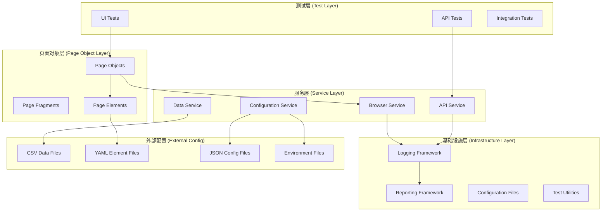

# 企业级 C# + Playwright + xUnit 自动化测试框架

## 需求设计文档（Requirement Design Document）

---

## 1. 文档目的

本文档在《需求文档》的基础上，进一步明确：

- 框架的整体设计原则
- 各模块的职责边界与约束
- 关键需求的设计决策与工程权衡
- 为后续实现提供一致、可维护、可扩展的技术蓝图

本文档是 **自动化测试框架设计与实现的权威依据**。

---

## 2. 设计目标

### 2.1 总体目标

构建一个 **面向测试工程的企业级自动化测试框架**，满足以下目标：

- 支持 Web UI 与 API 自动化测试
- 支持多流程、多角色、多环境测试场景
- 强调可维护性、稳定性与可读性
- 支持长期演进与团队协作

---

### 2.2 非目标（明确排除）

为避免过度设计，明确以下非目标：

- 不构建业务 Domain 层
- 不追求纯 MVC 或纯洋葱架构的形式完整性
- 不将自动化测试框架作为业务 SDK 或业务层复用组件

---

## 3. 总体架构设计

### 3.1 架构风格

框架采用 **分层 Page Object + Flow + Fixture 驱动架构**：

```
Tests（断言 & 测试意图）
↓
Scenarios（跨流程编排，可选）
↓
Flows（业务流程单元）
↓
Pages / Components（UI 封装）
↓
Playwright / HTTP 
```

---

### 3.2 分层职责说明（核心约束）

| 层级 | 职责说明 | 禁止事项 |
|----|----|----|
| Tests | 表达测试意图、断言结果 | 禁止直接操作 Page |
| Scenarios | 多流程组合与编排 | 禁止断言 |
| Flows | 单一业务流程封装 | 禁止使用 Assert / Expect |
| Pages | 页面操作与定位封装 | 禁止跨页面业务逻辑 |
| Components | 可复用页面区域 | 禁止场景逻辑 |

---

## 4. 模块设计说明

---

### 4.1 Fixture 层设计（生命周期管理）

#### 设计目标

- 统一管理 Playwright 生命周期
- 支持并行执行
- 确保测试用例之间的隔离性

#### 设计约束

- 每个测试用例必须使用独立的 `BrowserContext`
- 禁止使用 `static Page / Context`
- Fixture 中不得包含任何业务逻辑或断言

---

### 4.2 UI 自动化模块设计

#### 4.2.1 Page Object 设计原则

Page Object 仅负责：

- 页面导航
- 元素操作
- 页面状态读取

Page Object 不允许包含：

- 断言逻辑
- 跨页面业务流程

---

#### 4.2.2 元素定位器管理策略（重要设计决策）

采用 **混合定位器管理策略**：

| 定位器类型 | 管理方式 |
|---|---|
| 稳定核心定位器 | 定义在 Page Object 内 |
| 易变 / 配置型定位器 | 定义在 YAML 文件中 |

**禁止** 将所有定位器完全外置到 YAML 文件，以避免类型安全和可维护性问题。

---

#### 4.2.3 UI 测试参数化设计

| 参数类型 | 数据来源 |
|---|---|
| 简单矩阵数据 | CSV |
| 复杂业务场景 | JSON / YAML |
| 环境配置 | appsettings.{env}.json |

---

### 4.3 Flow 模块设计（多流程核心）

#### 设计目标

- 抽象用户行为
- 支持流程复用
- 降低 Test 层与 Page 层的耦合

#### Flow 设计约束

- 一个 Flow 表达一个完整业务动作
- Flow 不得跨业务边界
- Flow 中禁止包含断言逻辑

---

### 4.4 Scenario 模块设计（推荐）

#### 使用场景

- 多流程串联
- 多角色交互
- 端到端业务链路测试

#### 设计原则

- Scenario 由多个 Flow 组合而成
- Scenario 不直接操作 Page Object
- Scenario 不包含断言逻辑

---

## 5. API 自动化模块设计

### 5.1 API 模块定位

API 自动化主要用于：

- 接口功能验证
- 测试数据准备
- 测试结果校验辅助

---

### 5.2 UI 与 API 边界约定（关键）

- UI 测试仅验证用户可见行为
- API 测试不替代 UI 行为验证
- 禁止使用 API 返回结果作为 UI 测试断言依据

---

### 5.3 API 封装设计

- 提供统一 HTTP Client 封装
- 支持 GET / POST / PUT / DELETE
- 支持 Header / Query / Body 参数化
- 响应验证支持：
  - 状态码校验
  - 内容匹配
  - JSON Path 校验

---

## 6. 多环境与配置管理设计

### 6.1 环境支持

支持以下环境：

- dev
- test
- staging
- prod

支持通过命令行或配置文件选择环境：

```bash
dotnet test --env=test
```

### 6.2 配置加载策略

- 启动时加载对应环境配置
- 支持配置格式校验
- 不支持运行时业务配置热加载（避免测试不确定性）

---

## 7. 测试执行控制设计

### 7.1 测试类型标记

使用 xUnit Trait 进行测试类型标记：

```csharp
[Trait("Type", "UI")]
[Trait("Type", "API")]
```

### 7.2 执行策略

| 执行场景 | 行为 |
|---|---|
| 仅 UI 测试 | 执行 UI 标记测试 |
| 仅 API 测试 | 执行 API 标记测试 |
| 混合执行 | 同时执行 UI 与 API |

---

## 8. 日志、错误与截图设计

### 8.1 日志设计

- 支持日志级别：Debug / Info / Warning / Error
- 支持日志文件轮转与清理
- 日志信息与测试用例关联

### 8.2 截图策略

- 仅在 UI 测试失败时自动截图
- 截图文件名包含：
  - 测试名称
  - 时间戳
  - 浏览器类型
- 截图需与测试报告关联

---

## 9. 自动化测试报告设计

### 9.1 报告形式

- HTML 格式测试报告
- 支持历史执行结果对比
- 推荐集成 Allure 或 Extent Reports

### 9.2 报告内容

- 测试用例统计（通过 / 失败 / 跳过）
- 执行耗时
- 失败原因与堆栈信息
- 失败截图展示

---

## 10. 并行执行与稳定性设计

- 默认支持测试并行执行
- 每个测试用例使用独立上下文
- 禁止共享状态
- 可选支持 UI 测试失败重试机制

---

## 11. 质量与可维护性约束（企业级）

- Page / Flow 类行数限制
- 禁止巨石 Page Object
- 强制代码审查与规范校验

## 架构设计

### 整体架构图



### 分层架构说明

1. **测试层 (Test Layer)**：包含具体的测试用例实现
2. **页面对象层 (Page Object Layer)**：封装页面元素和操作
3. **服务层 (Service Layer)**：提供核心业务服务
4. **基础设施层 (Infrastructure Layer)**：提供框架基础功能

## 组件和接口

### 1. 核心接口设计

#### IPageObject 接口
```csharp
public interface IPageObject
{
    Task NavigateAsync(string url);
    Task<bool> IsLoadedAsync();
    Task WaitForLoadAsync(int timeoutMs = 30000);
}
```

#### ITestFixture 接口
```csharp
public interface ITestFixture : IAsyncLifetime
{
    IPlaywright Playwright { get; }
    IBrowser Browser { get; }
    IBrowserContext Context { get; }
    IPage Page { get; }
    TestConfiguration Configuration { get; }
}
```

#### IApiClient 接口
```csharp
public interface IApiClient
{
    Task<HttpResponseMessage> GetAsync(string endpoint, Dictionary<string, string> headers = null);
    Task<HttpResponseMessage> PostAsync(string endpoint, object data, Dictionary<string, string> headers = null);
    Task<HttpResponseMessage> PutAsync(string endpoint, object data, Dictionary<string, string> headers = null);
    Task<HttpResponseMessage> DeleteAsync(string endpoint, Dictionary<string, string> headers = null);
}
```

### 2. 配置管理组件

#### TestConfiguration 类
```csharp
public class TestConfiguration
{
    public EnvironmentSettings Environment { get; set; }
    public BrowserSettings Browser { get; set; }
    public ApiSettings Api { get; set; }
    public ReportingSettings Reporting { get; set; }
    public LoggingSettings Logging { get; set; }
}
```

#### 环境配置
```csharp
public class EnvironmentSettings
{
    public string Name { get; set; }
    public string BaseUrl { get; set; }
    public string ApiBaseUrl { get; set; }
    public Dictionary<string, string> Variables { get; set; }
}
```

### 3. 数据管理组件

#### CSV数据读取器
```csharp
public class CsvDataReader
{
    public IEnumerable<T> ReadData<T>(string filePath) where T : class, new();
    public IEnumerable<Dictionary<string, object>> ReadDynamicData(string filePath);
}
```

#### YAML元素读取器
```csharp
public class YamlElementReader
{
    public PageElementCollection LoadElements(string filePath);
    public PageElement GetElement(string pageName, string elementName);
}
```

### 4. 浏览器服务组件

#### BrowserService 类
```csharp
public class BrowserService : IBrowserService
{
    public async Task<IPage> CreatePageAsync(BrowserSettings settings);
    public async Task<byte[]> TakeScreenshotAsync(IPage page, string fileName);
    public async Task CloseAsync();
}
```

### 5. API服务组件

#### ApiService 类
```csharp
public class ApiService : IApiService
{
    public async Task<ApiResponse<T>> SendRequestAsync<T>(ApiRequest request);
    public async Task<ApiResponse> ValidateResponseAsync(HttpResponseMessage response, ApiValidation validation);
}
```

## 数据模型

### 1. 页面元素模型

```csharp
public class PageElement
{
    public string Name { get; set; }
    public string Selector { get; set; }
    public ElementType Type { get; set; }
    public int TimeoutMs { get; set; } = 30000;
    public Dictionary<string, string> Attributes { get; set; }
}

public enum ElementType
{
    Button,
    Input,
    Link,
    Text,
    Dropdown,
    Checkbox,
    Radio
}
```

### 2. 测试数据模型

```csharp
public class TestData
{
    public string TestName { get; set; }
    public Dictionary<string, object> Parameters { get; set; }
    public string Environment { get; set; }
    public bool Enabled { get; set; } = true;
}
```

### 3. API请求模型

```csharp
public class ApiRequest
{
    public string Method { get; set; }
    public string Endpoint { get; set; }
    public object Body { get; set; }
    public Dictionary<string, string> Headers { get; set; }
    public Dictionary<string, string> QueryParameters { get; set; }
}

public class ApiResponse<T>
{
    public int StatusCode { get; set; }
    public T Data { get; set; }
    public string RawContent { get; set; }
    public Dictionary<string, string> Headers { get; set; }
    public TimeSpan ResponseTime { get; set; }
}
```

### 4. 测试结果模型

```csharp
public class TestResult
{
    public string TestName { get; set; }
    public TestStatus Status { get; set; }
    public DateTime StartTime { get; set; }
    public DateTime EndTime { get; set; }
    public TimeSpan Duration { get; set; }
    public string ErrorMessage { get; set; }
    public string StackTrace { get; set; }
    public List<string> Screenshots { get; set; }
    public Dictionary<string, object> TestData { get; set; }
}

public enum TestStatus
{
    Passed,
    Failed,
    Skipped,
    Inconclusive
}
```

## 错误处理

### 1. 异常处理策略

#### 自定义异常类型
```csharp
public class TestFrameworkException : Exception
{
    public string TestName { get; }
    public string Component { get; }
    
    public TestFrameworkException(string testName, string component, string message, Exception innerException = null)
        : base(message, innerException)
    {
        TestName = testName;
        Component = component;
    }
}

public class ElementNotFoundException : TestFrameworkException
{
    public string Selector { get; }
    
    public ElementNotFoundException(string testName, string selector, string message)
        : base(testName, "PageObject", message)
    {
        Selector = selector;
    }
}

public class ApiException : TestFrameworkException
{
    public int StatusCode { get; }
    public string Endpoint { get; }
    
    public ApiException(string testName, string endpoint, int statusCode, string message)
        : base(testName, "ApiService", message)
    {
        StatusCode = statusCode;
        Endpoint = endpoint;
    }
}
```

### 2. 重试机制

```csharp
public class RetryPolicy
{
    public int MaxAttempts { get; set; } = 3;
    public TimeSpan DelayBetweenAttempts { get; set; } = TimeSpan.FromSeconds(1);
    public List<Type> RetryableExceptions { get; set; }
}
```

### 3. 错误恢复

- **页面刷新恢复**：当页面元素不可用时自动刷新页面
- **浏览器重启恢复**：当浏览器崩溃时自动重启浏览器实例
- **API重试恢复**：当API调用失败时根据配置进行重试

## 测试策略

### 1. UI测试策略

#### Page Object模式实现
```csharp
public abstract class BasePage : IPageObject
{
    protected readonly IPage _page;
    protected readonly YamlElementReader _elementReader;
    protected readonly ILogger _logger;
    
    public virtual async Task NavigateAsync(string url)
    {
        await _page.GotoAsync(url);
        await WaitForLoadAsync();
    }
    
    public abstract Task<bool> IsLoadedAsync();
    public abstract Task WaitForLoadAsync(int timeoutMs = 30000);
}

public class HomePage : BasePage
{
    public HomePage(IPage page, YamlElementReader elementReader, ILogger logger)
        : base(page, elementReader, logger) { }
    
    public async Task SearchAsync(string query)
    {
        var searchBox = _elementReader.GetElement("HomePage", "SearchBox");
        await _page.FillAsync(searchBox.Selector, query);
        
        var searchButton = _elementReader.GetElement("HomePage", "SearchButton");
        await _page.ClickAsync(searchButton.Selector);
    }
}
```

#### 测试用例结构
```csharp
public class HomePageTests : IClassFixture<BrowserFixture>
{
    private readonly BrowserFixture _fixture;
    private readonly HomePage _homePage;
    
    [Theory]
    [CsvData("TestData/search_data.csv")]
    public async Task SearchFunctionality_ShouldReturnResults(SearchTestData data)
    {
        // Arrange
        await _homePage.NavigateAsync(data.BaseUrl);
        
        // Act
        await _homePage.SearchAsync(data.SearchQuery);
        
        // Assert
        var results = await _homePage.GetSearchResultsAsync();
        Assert.NotEmpty(results);
    }
}
```

### 2. API测试策略

#### API测试基类
```csharp
public abstract class BaseApiTest
{
    protected readonly IApiClient _apiClient;
    protected readonly TestConfiguration _configuration;
    protected readonly ILogger _logger;
    
    protected async Task<ApiResponse<T>> ExecuteApiTestAsync<T>(ApiRequest request)
    {
        try
        {
            var response = await _apiClient.SendRequestAsync<T>(request);
            _logger.LogInformation($"API调用成功: {request.Method} {request.Endpoint}");
            return response;
        }
        catch (Exception ex)
        {
            _logger.LogError(ex, $"API调用失败: {request.Method} {request.Endpoint}");
            throw;
        }
    }
}
```

### 3. 集成测试策略

#### 端到端测试流程
```csharp
public class EndToEndTests : IClassFixture<IntegrationTestFixture>
{
    [Fact]
    public async Task CompleteUserJourney_ShouldWorkEndToEnd()
    {
        // 1. API准备数据
        await _apiClient.CreateTestDataAsync();
        
        // 2. UI操作验证
        await _homePage.NavigateAsync(_configuration.BaseUrl);
        await _homePage.PerformUserActionsAsync();
        
        // 3. API验证结果
        var result = await _apiClient.VerifyDataAsync();
        Assert.True(result.IsSuccess);
    }
}
```

### 4. 数据驱动测试

#### CSV数据属性
```csharp
public class CsvDataAttribute : DataAttribute
{
    private readonly string _filePath;
    
    public CsvDataAttribute(string filePath)
    {
        _filePath = filePath;
    }
    
    public override IEnumerable<object[]> GetData(MethodInfo testMethod)
    {
        var csvReader = new CsvDataReader();
        return csvReader.ReadDynamicData(_filePath)
            .Select(row => new object[] { row });
    }
}
```

## 配置文件结构

### 1. 环境配置 (appsettings.{Environment}.json)

```json
{
  "Environment": {
    "Name": "Development",
    "BaseUrl": "https://www.baidu.com",
    "ApiBaseUrl": "https://www.baidu.com/api"
  },
  "Browser": {
    "Type": "Chromium",
    "Headless": false,
    "ViewportWidth": 1920,
    "ViewportHeight": 1080,
    "Timeout": 30000
  },
  "Api": {
    "Timeout": 30000,
    "RetryCount": 3,
    "RetryDelay": 1000
  },
  "Logging": {
    "Level": "Information",
    "FilePath": "Logs/test-{Date}.log"
  },
  "Reporting": {
    "OutputPath": "Reports",
    "Format": "Html",
    "IncludeScreenshots": true
  }
}
```

### 2. 页面元素配置 (Elements/HomePage.yaml)

```yaml
HomePage:
  SearchBox:
    selector: "#kw"
    type: Input
    timeout: 5000
  SearchButton:
    selector: "#su"
    type: Button
    timeout: 5000
  SearchResults:
    selector: ".result"
    type: Text
    timeout: 10000
```

### 3. 测试数据配置 (TestData/search_data.csv)

```csv
TestName,SearchQuery,ExpectedResultCount,Environment
搜索功能测试1,playwright,10,Development
搜索功能测试2,自动化测试,5,Development
搜索功能测试3,C#,15,Development
```

## 日志和报告

### 1. 日志框架集成

使用Serilog进行结构化日志记录：

```csharp
public static class LoggerConfiguration
{
    public static ILogger CreateLogger(LoggingSettings settings)
    {
        return new LoggerConfiguration()
            .MinimumLevel.Is(settings.Level)
            .WriteTo.Console()
            .WriteTo.File(settings.FilePath, rollingInterval: RollingInterval.Day)
            .WriteTo.Seq("http://localhost:5341") // 可选的集中日志服务
            .CreateLogger();
    }
}
```

### 2. 报告生成

#### HTML报告模板
- 测试执行摘要
- 详细测试结果
- 失败截图展示
- 性能指标图表
- 历史趋势对比

#### 报告数据模型
```csharp
public class TestReport
{
    public DateTime GeneratedAt { get; set; }
    public string Environment { get; set; }
    public TestSummary Summary { get; set; }
    public List<TestResult> Results { get; set; }
    public List<string> Screenshots { get; set; }
    public Dictionary<string, object> Metadata { get; set; }
}

public class TestSummary
{
    public int TotalTests { get; set; }
    public int PassedTests { get; set; }
    public int FailedTests { get; set; }
    public int SkippedTests { get; set; }
    public TimeSpan TotalDuration { get; set; }
    public double PassRate => TotalTests > 0 ? (double)PassedTests / TotalTests * 100 : 0;
}
```

## 部署和CI/CD集成

### 1. 项目结构

```
EnterpriseAutomationFramework/
├── src/
│   ├── Framework/
│   │   ├── Core/
│   │   ├── PageObjects/
│   │   ├── Services/
│   │   └── Utilities/
│   └── Tests/
│       ├── UI/
│       ├── API/
│       └── Integration/
├── config/
│   ├── environments/
│   ├── elements/
│   └── testdata/
├── reports/
├── logs/
└── screenshots/
```

### 2. CI/CD管道配置

支持Azure DevOps、GitHub Actions、Jenkins等CI/CD平台的集成配置。

### 3. Docker支持

提供Docker容器化部署，支持在容器环境中运行测试。