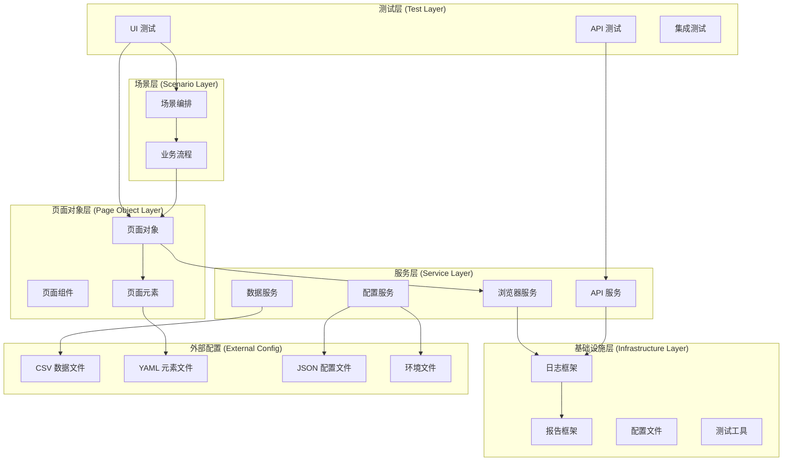

# 设计文档

## 概述

本文档描述了企业级 C# + Playwright + xUnit 自动化测试框架的详细设计。该框架采用分层架构，支持 Web UI 和 API 自动化测试，具有高可维护性、稳定性和可扩展性。

## 架构

### 整体架构图



### 分层架构说明

1. **测试层 (Test Layer)**：包含具体的测试用例实现，负责断言和测试意图表达
2. **场景层 (Scenario Layer)**：处理多流程编排和业务流程抽象
3. **页面对象层 (Page Object Layer)**：封装页面元素和操作
4. **服务层 (Service Layer)**：提供核心业务服务
5. **基础设施层 (Infrastructure Layer)**：提供框架基础功能

## 组件和接口

### 1. 核心接口设计

#### IPageObject 接口
```csharp
/// <summary>
/// 页面对象基础接口
/// </summary>
namespace CsPlaywrightXun.src.playwright.Core.Interfaces
{
    public interface IPageObject
    {
        /// <summary>
        /// 导航到指定URL
        /// </summary>
        /// <param name="url">目标URL</param>
        Task NavigateAsync(string url);
        
        /// <summary>
        /// 检查页面是否已加载
        /// </summary>
        /// <returns>页面加载状态</returns>
        Task<bool> IsLoadedAsync();
        
        /// <summary>
        /// 等待页面加载完成
        /// </summary>
        /// <param name="timeoutMs">超时时间（毫秒）</param>
        Task WaitForLoadAsync(int timeoutMs = 30000);
    }
}
```

#### ITestFixture 接口
```csharp
/// <summary>
/// 测试固件接口，管理 Playwright 生命周期
/// </summary>
namespace CsPlaywrightXun.src.playwright.Core.Interfaces
{
    public interface ITestFixture : IAsyncLifetime
    {
        /// <summary>
        /// Playwright 实例
        /// </summary>
        IPlaywright Playwright { get; }
        
        /// <summary>
        /// 浏览器实例
        /// </summary>
        IBrowser Browser { get; }
        
        /// <summary>
        /// 浏览器上下文
        /// </summary>
        IBrowserContext Context { get; }
        
        /// <summary>
        /// 页面实例
        /// </summary>
        IPage Page { get; }
        
        /// <summary>
        /// 测试配置
        /// </summary>
        TestConfiguration Configuration { get; }
    }
}
```

#### IApiClient 接口
```csharp
/// <summary>
/// API 客户端接口
/// </summary>
namespace CsPlaywrightXun.src.playwright.Core.Interfaces
{
    public interface IApiClient
    {
        /// <summary>
        /// 发送 GET 请求
        /// </summary>
        Task<HttpResponseMessage> GetAsync(string endpoint, Dictionary<string, string> headers = null);
        
        /// <summary>
        /// 发送 POST 请求
        /// </summary>
        Task<HttpResponseMessage> PostAsync(string endpoint, object data, Dictionary<string, string> headers = null);
        
        /// <summary>
        /// 发送 PUT 请求
        /// </summary>
        Task<HttpResponseMessage> PutAsync(string endpoint, object data, Dictionary<string, string> headers = null);
        
        /// <summary>
        /// 发送 DELETE 请求
        /// </summary>
        Task<HttpResponseMessage> DeleteAsync(string endpoint, Dictionary<string, string> headers = null);
    }
}
```

#### IFlow 接口
```csharp
/// <summary>
/// 业务流程接口
/// </summary>
namespace CsPlaywrightXun.src.playwright.Core.Interfaces
{
    public interface IFlow
    {
        /// <summary>
        /// 执行业务流程
        /// </summary>
        /// <param name="parameters">流程参数</param>
        Task ExecuteAsync(Dictionary<string, object> parameters = null);
    }
}
```

### 2. 配置管理组件

#### TestConfiguration 类
```csharp
/// <summary>
/// 测试配置类
/// </summary>
namespace CsPlaywrightXun.src.playwright.Core.Configuration
{
    public class TestConfiguration
    {
        /// <summary>
        /// 环境设置
        /// </summary>
        public EnvironmentSettings Environment { get; set; }
        
        /// <summary>
        /// 浏览器设置
        /// </summary>
        public BrowserSettings Browser { get; set; }
        
        /// <summary>
        /// API 设置
        /// </summary>
        public ApiSettings Api { get; set; }
        
        /// <summary>
        /// 报告设置
        /// </summary>
        public ReportingSettings Reporting { get; set; }
        
        /// <summary>
        /// 日志设置
        /// </summary>
        public LoggingSettings Logging { get; set; }
    }
}
```

#### 环境配置
```csharp
/// <summary>
/// 环境设置
/// </summary>
namespace CsPlaywrightXun.src.playwright.Core.Configuration
{
    public class EnvironmentSettings
    {
        /// <summary>
        /// 环境名称
        /// </summary>
        public string Name { get; set; }
        
        /// <summary>
        /// 基础URL
        /// </summary>
        public string BaseUrl { get; set; }
        
        /// <summary>
        /// API基础URL
        /// </summary>
        public string ApiBaseUrl { get; set; }
        
        /// <summary>
        /// 环境变量
        /// </summary>
        public Dictionary<string, string> Variables { get; set; }
    }
}
```

### 3. 数据管理组件

#### CSV数据读取器
```csharp
/// <summary>
/// CSV 数据读取器
/// </summary>
namespace CsPlaywrightXun.src.playwright.Services.Data
{
    public class CsvDataReader
    {
        /// <summary>
        /// 读取强类型数据
        /// </summary>
        /// <typeparam name="T">数据类型</typeparam>
        /// <param name="filePath">文件路径</param>
        /// <returns>数据集合</returns>
        public IEnumerable<T> ReadData<T>(string filePath) where T : class, new();
        
        /// <summary>
        /// 读取动态数据
        /// </summary>
        /// <param name="filePath">文件路径</param>
        /// <returns>动态数据集合</returns>
        public IEnumerable<Dictionary<string, object>> ReadDynamicData(string filePath);
    }
}
```

#### YAML元素读取器
```csharp
/// <summary>
/// YAML 元素读取器
/// </summary>
namespace CsPlaywrightXun.src.playwright.Services.Data
{
    public class YamlElementReader
    {
        /// <summary>
        /// 加载页面元素集合
        /// </summary>
        /// <param name="filePath">文件路径</param>
        /// <returns>页面元素集合</returns>
        public PageElementCollection LoadElements(string filePath);
        
        /// <summary>
        /// 获取指定页面的元素
        /// </summary>
        /// <param name="pageName">页面名称</param>
        /// <param name="elementName">元素名称</param>
        /// <returns>页面元素</returns>
        public PageElement GetElement(string pageName, string elementName);
    }
}
```

### 4. 浏览器服务组件

#### BrowserService 类
```csharp
/// <summary>
/// 浏览器服务
/// </summary>
namespace CsPlaywrightXun.src.playwright.Services.Browser
{
    public class BrowserService : IBrowserService
    {
        /// <summary>
        /// 创建页面实例
        /// </summary>
        /// <param name="settings">浏览器设置</param>
        /// <returns>页面实例</returns>
        public async Task<IPage> CreatePageAsync(BrowserSettings settings);
        
        /// <summary>
        /// 截取屏幕截图
        /// </summary>
        /// <param name="page">页面实例</param>
        /// <param name="fileName">文件名</param>
        /// <returns>截图字节数组</returns>
        public async Task<byte[]> TakeScreenshotAsync(IPage page, string fileName);
        
        /// <summary>
        /// 关闭浏览器服务
        /// </summary>
        public async Task CloseAsync();
    }
}
```

### 5. API服务组件

#### ApiService 类
```csharp
/// <summary>
/// API 服务
/// </summary>
namespace CsPlaywrightXun.src.playwright.Services.Api
{
    public class ApiService : IApiService
    {
        /// <summary>
        /// 发送API请求
        /// </summary>
        /// <typeparam name="T">响应数据类型</typeparam>
        /// <param name="request">API请求</param>
        /// <returns>API响应</returns>
        public async Task<ApiResponse<T>> SendRequestAsync<T>(ApiRequest request);
        
        /// <summary>
        /// 验证API响应
        /// </summary>
        /// <param name="response">HTTP响应</param>
        /// <param name="validation">验证规则</param>
        /// <returns>验证结果</returns>
        public async Task<ApiResponse> ValidateResponseAsync(HttpResponseMessage response, ApiValidation validation);
    }
}
```

## 数据模型

### 1. 页面元素模型

```csharp
/// <summary>
/// 页面元素
/// </summary>
namespace CsPlaywrightXun.src.playwright.Services.Data
{
    public class PageElement
    {
        /// <summary>
        /// 元素名称
        /// </summary>
        public string Name { get; set; }
        
        /// <summary>
        /// 元素选择器
        /// </summary>
        public string Selector { get; set; }
        
        /// <summary>
        /// 元素类型
        /// </summary>
        public ElementType Type { get; set; }
        
        /// <summary>
        /// 超时时间（毫秒）
        /// </summary>
        public int TimeoutMs { get; set; } = 30000;
        
        /// <summary>
        /// 元素属性
        /// </summary>
        public Dictionary<string, string> Attributes { get; set; }
    }

    /// <summary>
    /// 元素类型枚举
    /// </summary>
    public enum ElementType
    {
        /// <summary>
        /// 按钮
        /// </summary>
        Button,
        
        /// <summary>
        /// 输入框
        /// </summary>
        Input,
        
        /// <summary>
        /// 链接
        /// </summary>
        Link,
        
        /// <summary>
        /// 文本
        /// </summary>
        Text,
        
        /// <summary>
        /// 下拉框
        /// </summary>
        Dropdown,
        
        /// <summary>
        /// 复选框
        /// </summary>
        Checkbox,
        
        /// <summary>
        /// 单选框
        /// </summary>
        Radio
    }
}
```

### 2. 测试数据模型

```csharp
/// <summary>
/// 测试数据
/// </summary>
public class TestData
{
    /// <summary>
    /// 测试名称
    /// </summary>
    public string TestName { get; set; }
    
    /// <summary>
    /// 测试参数
    /// </summary>
    public Dictionary<string, object> Parameters { get; set; }
    
    /// <summary>
    /// 环境名称
    /// </summary>
    public string Environment { get; set; }
    
    /// <summary>
    /// 是否启用
    /// </summary>
    public bool Enabled { get; set; } = true;
}
```

### 3. API请求模型

```csharp
/// <summary>
/// API 请求
/// </summary>
namespace CsPlaywrightXun.src.playwright.Services.Api
{
    public class ApiRequest
    {
        /// <summary>
        /// HTTP 方法
        /// </summary>
        public string Method { get; set; }
        
        /// <summary>
        /// 请求端点
        /// </summary>
        public string Endpoint { get; set; }
        
        /// <summary>
        /// 请求体
        /// </summary>
        public object Body { get; set; }
        
        /// <summary>
        /// 请求头
        /// </summary>
        public Dictionary<string, string> Headers { get; set; }
        
        /// <summary>
        /// 查询参数
        /// </summary>
        public Dictionary<string, string> QueryParameters { get; set; }
    }

    /// <summary>
    /// API 响应
    /// </summary>
    /// <typeparam name="T">响应数据类型</typeparam>
    public class ApiResponse<T>
    {
        /// <summary>
        /// 状态码
        /// </summary>
        public int StatusCode { get; set; }
        
        /// <summary>
        /// 响应数据
        /// </summary>
        public T Data { get; set; }
        
        /// <summary>
        /// 原始内容
        /// </summary>
        public string RawContent { get; set; }
        
        /// <summary>
        /// 响应头
        /// </summary>
        public Dictionary<string, string> Headers { get; set; }
        
        /// <summary>
        /// 响应时间
        /// </summary>
        public TimeSpan ResponseTime { get; set; }
    }
}
```

### 4. 测试结果模型

```csharp
/// <summary>
/// 测试结果
/// </summary>
namespace CsPlaywrightXun.src.playwright.Core.Models
{
    public class TestResult
    {
        /// <summary>
        /// 测试名称
        /// </summary>
        public string TestName { get; set; }
        
        /// <summary>
        /// 测试状态
        /// </summary>
        public TestStatus Status { get; set; }
        
        /// <summary>
        /// 开始时间
        /// </summary>
        public DateTime StartTime { get; set; }
        
        /// <summary>
        /// 结束时间
        /// </summary>
        public DateTime EndTime { get; set; }
        
        /// <summary>
        /// 执行时长
        /// </summary>
        public TimeSpan Duration { get; set; }
        
        /// <summary>
        /// 错误消息
        /// </summary>
        public string ErrorMessage { get; set; }
        
        /// <summary>
        /// 堆栈跟踪
        /// </summary>
        public string StackTrace { get; set; }
        
        /// <summary>
        /// 截图列表
        /// </summary>
        public List<string> Screenshots { get; set; }
        
        /// <summary>
        /// 测试数据
        /// </summary>
        public Dictionary<string, object> TestData { get; set; }
    }

    /// <summary>
    /// 测试状态枚举
    /// </summary>
    public enum TestStatus
    {
        /// <summary>
        /// 通过
        /// </summary>
        Passed,
        
        /// <summary>
        /// 失败
        /// </summary>
        Failed,
        
        /// <summary>
        /// 跳过
        /// </summary>
        Skipped,
        
        /// <summary>
        /// 不确定
        /// </summary>
        Inconclusive
    }
}
```

## 错误处理

### 1. 异常处理策略

#### 自定义异常类型
```csharp
/// <summary>
/// 测试框架异常基类
/// </summary>
namespace CsPlaywrightXun.src.playwright.Core.Exceptions
{
    public class TestFrameworkException : Exception
    {
        /// <summary>
        /// 测试名称
        /// </summary>
        public string TestName { get; }
        
        /// <summary>
        /// 组件名称
        /// </summary>
        public string Component { get; }
        
        /// <summary>
        /// 构造函数
        /// </summary>
        /// <param name="testName">测试名称</param>
        /// <param name="component">组件名称</param>
        /// <param name="message">错误消息</param>
        /// <param name="innerException">内部异常</param>
        public TestFrameworkException(string testName, string component, string message, Exception innerException = null)
            : base(message, innerException)
        {
            TestName = testName;
            Component = component;
        }
    }

    /// <summary>
    /// 元素未找到异常
    /// </summary>
    public class ElementNotFoundException : TestFrameworkException
    {
        /// <summary>
        /// 元素选择器
        /// </summary>
        public string Selector { get; }
        
        /// <summary>
        /// 构造函数
        /// </summary>
        /// <param name="testName">测试名称</param>
        /// <param name="selector">元素选择器</param>
        /// <param name="message">错误消息</param>
        public ElementNotFoundException(string testName, string selector, string message)
            : base(testName, "PageObject", message)
        {
            Selector = selector;
        }
    }

    /// <summary>
    /// API 异常
    /// </summary>
    public class ApiException : TestFrameworkException
    {
        /// <summary>
        /// 状态码
        /// </summary>
        public int StatusCode { get; }
        
        /// <summary>
        /// 请求端点
        /// </summary>
        public string Endpoint { get; }
        
        /// <summary>
        /// 构造函数
        /// </summary>
        /// <param name="testName">测试名称</param>
        /// <param name="endpoint">请求端点</param>
        /// <param name="statusCode">状态码</param>
        /// <param name="message">错误消息</param>
        public ApiException(string testName, string endpoint, int statusCode, string message)
            : base(testName, "ApiService", message)
        {
            StatusCode = statusCode;
            Endpoint = endpoint;
        }
    }
}
```

### 2. 重试机制

```csharp
/// <summary>
/// 重试策略
/// </summary>
namespace CsPlaywrightXun.src.playwright.Core.Utilities
{
    public class RetryPolicy
    {
        /// <summary>
        /// 最大重试次数
        /// </summary>
        public int MaxAttempts { get; set; } = 3;
        
        /// <summary>
        /// 重试间隔时间
        /// </summary>
        public TimeSpan DelayBetweenAttempts { get; set; } = TimeSpan.FromSeconds(1);
        
        /// <summary>
        /// 可重试的异常类型
        /// </summary>
        public List<Type> RetryableExceptions { get; set; }
    }
}
```

### 3. 错误恢复策略

- **页面刷新恢复**：当页面元素不可用时自动刷新页面
- **浏览器重启恢复**：当浏览器崩溃时自动重启浏览器实例
- **API重试恢复**：当API调用失败时根据配置进行重试

## 测试策略

### 1. UI测试策略

#### Page Object模式实现
```csharp
/// <summary>
/// 页面对象基类
/// </summary>
namespace CsPlaywrightXun.src.playwright.Core.Base
{
    public abstract class BasePage : IPageObject
    {
        protected readonly IPage _page;
        protected readonly YamlElementReader _elementReader;
        protected readonly ILogger _logger;
        
        /// <summary>
        /// 构造函数
        /// </summary>
        /// <param name="page">页面实例</param>
        /// <param name="elementReader">元素读取器</param>
        /// <param name="logger">日志记录器</param>
        protected BasePage(IPage page, YamlElementReader elementReader, ILogger logger)
        {
            _page = page;
            _elementReader = elementReader;
            _logger = logger;
        }
        
        /// <summary>
        /// 导航到指定URL
        /// </summary>
        /// <param name="url">目标URL</param>
        public virtual async Task NavigateAsync(string url)
        {
            await _page.GotoAsync(url);
            await WaitForLoadAsync();
        }
        
        /// <summary>
        /// 检查页面是否已加载
        /// </summary>
        /// <returns>页面加载状态</returns>
        public abstract Task<bool> IsLoadedAsync();
        
        /// <summary>
        /// 等待页面加载完成
        /// </summary>
        /// <param name="timeoutMs">超时时间（毫秒）</param>
        public abstract Task WaitForLoadAsync(int timeoutMs = 30000);
    }
}

/// <summary>
/// 首页页面对象
/// </summary>
namespace CsPlaywrightXun.src.playwright.Pages.UI.baidu
{
    public class HomePage : BasePage
    {
        /// <summary>
        /// 构造函数
        /// </summary>
        /// <param name="page">页面实例</param>
        /// <param name="elementReader">元素读取器</param>
        /// <param name="logger">日志记录器</param>
        public HomePage(IPage page, YamlElementReader elementReader, ILogger logger)
            : base(page, elementReader, logger) { }
        
        /// <summary>
        /// 执行搜索操作
        /// </summary>
        /// <param name="query">搜索关键词</param>
        public async Task SearchAsync(string query)
        {
            var searchBox = _elementReader.GetElement("HomePage", "SearchBox");
            await _page.FillAsync(searchBox.Selector, query);
            
            var searchButton = _elementReader.GetElement("HomePage", "SearchButton");
            await _page.ClickAsync(searchButton.Selector);
        }
        
        /// <summary>
        /// 检查页面是否已加载
        /// </summary>
        /// <returns>页面加载状态</returns>
        public override async Task<bool> IsLoadedAsync()
        {
            var searchBox = _elementReader.GetElement("HomePage", "SearchBox");
            return await _page.IsVisibleAsync(searchBox.Selector);
        }
        
        /// <summary>
        /// 等待页面加载完成
        /// </summary>
        /// <param name="timeoutMs">超时时间（毫秒）</param>
        public override async Task WaitForLoadAsync(int timeoutMs = 30000)
        {
            var searchBox = _elementReader.GetElement("HomePage", "SearchBox");
            await _page.WaitForSelectorAsync(searchBox.Selector, new() { Timeout = timeoutMs });
        }
    }
}
```

### 2. Flow 模式实现

```csharp
/// <summary>
/// 搜索流程
/// </summary>
namespace CsPlaywrightXun.src.playwright.Flows.baidu
{
    public class SearchFlow : IFlow
    {
        private readonly HomePage _homePage;
        private readonly ILogger _logger;
        
        /// <summary>
        /// 构造函数
        /// </summary>
        /// <param name="homePage">首页对象</param>
        /// <param name="logger">日志记录器</param>
        public SearchFlow(HomePage homePage, ILogger logger)
        {
            _homePage = homePage;
            _logger = logger;
        }
        
        /// <summary>
        /// 执行搜索流程
        /// </summary>
        /// <param name="parameters">流程参数</param>
        public async Task ExecuteAsync(Dictionary<string, object> parameters = null)
        {
            var searchQuery = parameters?["searchQuery"]?.ToString() ?? "默认搜索";
            
            _logger.LogInformation($"开始执行搜索流程，关键词：{searchQuery}");
            
            // 执行搜索操作
            await _homePage.SearchAsync(searchQuery);
            
            _logger.LogInformation("搜索流程执行完成");
        }
    }
}
```

### 3. 测试用例结构

```csharp
/// <summary>
/// 首页测试类
/// </summary>
namespace CsPlaywrightXun.Tests
{
    [Trait("Type", "UI")]
    public class HomePageTests : IClassFixture<BrowserFixture>
    {
        private readonly BrowserFixture _fixture;
        private readonly HomePage _homePage;
        private readonly SearchFlow _searchFlow;
        
        /// <summary>
        /// 构造函数
        /// </summary>
        /// <param name="fixture">浏览器固件</param>
        public HomePageTests(BrowserFixture fixture)
        {
            _fixture = fixture;
            _homePage = new HomePage(_fixture.Page, new YamlElementReader(), _fixture.Logger);
            _searchFlow = new SearchFlow(_homePage, _fixture.Logger);
        }
        
        /// <summary>
        /// 搜索功能测试
        /// </summary>
        /// <param name="data">测试数据</param>
        [Theory]
        [CsvData("TestData/search_data.csv")]
        public async Task SearchFunctionality_ShouldReturnResults(SearchTestData data)
        {
            // Arrange - 准备
            await _homePage.NavigateAsync(data.BaseUrl);
            
            // Act - 执行
            var parameters = new Dictionary<string, object>
            {
                ["searchQuery"] = data.SearchQuery
            };
            await _searchFlow.ExecuteAsync(parameters);
            
            // Assert - 断言
            var results = await _homePage.GetSearchResultsAsync();
            Assert.NotEmpty(results);
            Assert.True(results.Count >= data.ExpectedResultCount);
        }
    }
}
```

### 4. API测试策略

#### API测试基类
```csharp
/// <summary>
/// API 测试基类
/// </summary>
namespace CsPlaywrightXun.src.playwright.Core.Base
{
    [Trait("Type", "API")]
    public abstract class BaseApiTest
    {
        protected readonly IApiClient _apiClient;
        protected readonly TestConfiguration _configuration;
        protected readonly ILogger _logger;
        
        /// <summary>
        /// 构造函数
        /// </summary>
        /// <param name="apiClient">API客户端</param>
        /// <param name="configuration">测试配置</param>
        /// <param name="logger">日志记录器</param>
        protected BaseApiTest(IApiClient apiClient, TestConfiguration configuration, ILogger logger)
        {
            _apiClient = apiClient;
            _configuration = configuration;
            _logger = logger;
        }
        
        /// <summary>
        /// 执行API测试
        /// </summary>
        /// <typeparam name="T">响应数据类型</typeparam>
        /// <param name="request">API请求</param>
        /// <returns>API响应</returns>
        protected async Task<ApiResponse<T>> ExecuteApiTestAsync<T>(ApiRequest request)
        {
            try
            {
                var response = await _apiClient.SendRequestAsync<T>(request);
                _logger.LogInformation($"API调用成功: {request.Method} {request.Endpoint}");
                return response;
            }
            catch (Exception ex)
            {
                _logger.LogError(ex, $"API调用失败: {request.Method} {request.Endpoint}");
                throw;
            }
        }
    }
}
```

## 配置文件结构

### 1. 环境配置 (appsettings.{Environment}.json)

```json
{
  "Environment": {
    "Name": "Development",
    "BaseUrl": "https://www.baidu.com",
    "ApiBaseUrl": "https://www.baidu.com/api"
  },
  "Browser": {
    "Type": "Chromium",
    "Headless": false,
    "ViewportWidth": 1920,
    "ViewportHeight": 1080,
    "Timeout": 30000
  },
  "Api": {
    "Timeout": 30000,
    "RetryCount": 3,
    "RetryDelay": 1000
  },
  "Logging": {
    "Level": "Information",
    "FilePath": "src/conclusion/logs/test-{Date}.log"
  },
  "Reporting": {
    "OutputPath": "src/conclusion/reports",
    "Format": "Html",
    "IncludeScreenshots": true
  }
}
```

### 2. 页面元素配置 (src/config/elements/HomePage.yaml)

```yaml
HomePage:
  SearchBox:
    selector: "#kw"
    type: Input
    timeout: 5000
  SearchButton:
    selector: "#su"
    type: Button
    timeout: 5000
  SearchResults:
    selector: ".result"
    type: Text
    timeout: 10000
```

### 3. 测试数据配置 (src/config/date/search_data.csv)

```csv
TestName,SearchQuery,ExpectedResultCount,Environment
搜索功能测试1,playwright,10,Development
搜索功能测试2,自动化测试,5,Development
搜索功能测试3,C#,15,Development
```

## 日志和报告

### 1. 日志框架集成

使用Serilog进行结构化日志记录：

```csharp
/// <summary>
/// 日志配置
/// </summary>
namespace CsPlaywrightXun.src.playwright.Core.Logging
{
    public static class LoggerConfiguration
    {
        /// <summary>
        /// 创建日志记录器
        /// </summary>
        /// <param name="settings">日志设置</param>
        /// <returns>日志记录器实例</returns>
        public static ILogger CreateLogger(LoggingSettings settings)
        {
            return new LoggerConfiguration()
                .MinimumLevel.Is(settings.Level)
                .WriteTo.Console()
                .WriteTo.File(settings.FilePath, rollingInterval: RollingInterval.Day)
                .WriteTo.Seq("http://localhost:5341") // 可选的集中日志服务
                .CreateLogger();
        }
    }
}
```

### 2. 报告生成

#### 报告数据模型
```csharp
/// <summary>
/// 测试报告
/// </summary>
namespace CsPlaywrightXun.src.playwright.Core.Models
{
    public class TestReport
    {
        /// <summary>
        /// 生成时间
        /// </summary>
        public DateTime GeneratedAt { get; set; }
        
        /// <summary>
        /// 环境名称
        /// </summary>
        public string Environment { get; set; }
        
        /// <summary>
        /// 测试摘要
        /// </summary>
        public TestSummary Summary { get; set; }
        
        /// <summary>
        /// 测试结果列表
        /// </summary>
        public List<TestResult> Results { get; set; }
        
        /// <summary>
        /// 截图列表
        /// </summary>
        public List<string> Screenshots { get; set; }
        
        /// <summary>
        /// 元数据
        /// </summary>
        public Dictionary<string, object> Metadata { get; set; }
    }

    /// <summary>
    /// 测试摘要
    /// </summary>
    public class TestSummary
    {
        /// <summary>
        /// 总测试数
        /// </summary>
        public int TotalTests { get; set; }
        
        /// <summary>
        /// 通过测试数
        /// </summary>
        public int PassedTests { get; set; }
        
        /// <summary>
        /// 失败测试数
        /// </summary>
        public int FailedTests { get; set; }
        
        /// <summary>
        /// 跳过测试数
        /// </summary>
        public int SkippedTests { get; set; }
        
        /// <summary>
        /// 总执行时长
        /// </summary>
        public TimeSpan TotalDuration { get; set; }
        
        /// <summary>
        /// 通过率
        /// </summary>
        public double PassRate => TotalTests > 0 ? (double)PassedTests / TotalTests * 100 : 0;
    }
}
```

## 项目结构

```
CsPlaywrightXun/
├── src/                                   # 源代码根目录
│   ├── conclusion/                        # 输出目录
│   │   ├── logs/                         # 日志文件输出
│   │   ├── reports/                      # 测试报告输出
│   │   └── screenshots/                  # 截图文件输出
│   ├── config/                           # 配置文件目录
│   │   ├── date/                         # 测试数据配置
│   │   │   ├── API/                      # API测试数据
│   │   │   └── UI/                       # UI测试数据
│   │   ├── elements/                     # 页面元素配置
│   │   │   ├── empty_elements.yaml       # 空元素配置示例
│   │   │   ├── invalid_elements.yaml     # 无效元素配置示例
│   │   │   ├── minimal_elements.yaml     # 最小元素配置示例
│   │   │   ├── search_test_data.yaml     # 搜索测试数据
│   │   │   ├── test_elements.yaml        # 测试元素配置
│   │   │   └── valid_elements.yaml       # 有效元素配置示例
│   │   ├── environments/                 # 环境配置
│   │   │   ├── appsettings.json          # 默认配置
│   │   │   ├── appsettings.Development.json  # 开发环境配置
│   │   │   ├── appsettings.Test.json     # 测试环境配置
│   │   │   └── appsettings.Staging.json  # 预发布环境配置
│   │   ├── EnterpriseAutomationFramework.cs    # 框架入口类
│   │   └── EnterpriseAutomationFramework.csproj # 框架项目文件
│   ├── docs/                             # 文档目录
│   │   ├── design.md                     # 架构设计文档
│   │   ├── PlaywrightBaseClassGuide.md   # Playwright基类使用指南
│   │   ├── TestCategoryGuide.md          # 测试分类指南
│   │   ├── TestCategoryDemo.ps1          # 测试分类演示脚本
│   │   └── 文档.md                       # 中文文档
│   └── playwright/                       # 框架核心代码
│       ├── Core/                         # 核心组件
│       │   ├── Attributes/               # 测试属性和枚举
│       │   │   ├── TestCategoryAttribute.cs      # 测试分类属性
│       │   │   ├── TestCombinationAttributes.cs  # 测试组合属性
│       │   │   └── TestEnums.cs                  # 测试枚举定义
│       │   ├── Base/                     # 基类实现
│       │   │   ├── BaseApiTest.cs                # API测试基类
│       │   │   ├── BaseApiTestWithRecovery.cs    # 带恢复功能的API测试基类
│       │   │   ├── BaseFlow.cs                   # 业务流程基类
│       │   │   ├── BasePageObject.cs             # 页面对象基类
│       │   │   ├── BasePageObjectWithPlaywright.cs # Playwright页面对象基类
│       │   │   ├── BasePageObjectWithRecovery.cs # 带恢复功能的页面对象基类
│       │   │   └── BaseTestFixture.cs            # 测试固件基类
│       │   ├── Configuration/            # 配置管理
│       │   │   ├── ConfigurationManager.cs       # 配置管理器
│       │   │   ├── ConfigurationService.cs       # 配置服务
│       │   │   ├── TestConfiguration.cs          # 测试配置类
│       │   │   └── TestExecutionSettings.cs      # 测试执行设置
│       │   ├── Exceptions/               # 自定义异常
│       │   │   ├── ApiException.cs               # API异常
│       │   │   ├── CsvDataException.cs           # CSV数据异常
│       │   │   ├── ElementNotFoundException.cs   # 元素未找到异常
│       │   │   ├── RetryableException.cs         # 可重试异常
│       │   │   ├── TestFrameworkException.cs     # 测试框架异常基类
│       │   │   └── YamlDataException.cs          # YAML数据异常
│       │   ├── Extensions/               # 扩展方法
│       │   │   └── RetryExtensions.cs            # 重试扩展方法
│       │   ├── Fixtures/                 # 测试固件
│       │   │   └── BrowserFixture.cs             # 浏览器固件
│       │   ├── Interfaces/               # 接口定义
│       │   │   ├── IApiClient.cs                 # API客户端接口
│       │   │   ├── IApiPerformanceMonitor.cs     # API性能监控接口
│       │   │   ├── IBrowserService.cs            # 浏览器服务接口
│       │   │   ├── IDataProvider.cs              # 数据提供者接口
│       │   │   ├── IFlow.cs                      # 业务流程接口
│       │   │   ├── IPageObject.cs                # 页面对象接口
│       │   │   ├── IReporter.cs                  # 报告器接口
│       │   │   ├── IReportGenerator.cs           # 报告生成器接口
│       │   │   ├── IReportService.cs             # 报告服务接口
│       │   │   └── ITestFixture.cs               # 测试固件接口
│       │   ├── Logging/                  # 日志组件
│       │   │   ├── SerilogConfiguration.cs       # Serilog配置
│       │   │   └── TestContextLogger.cs          # 测试上下文日志记录器
│       │   ├── Models/                   # 数据模型
│       │   │   ├── TestReport.cs                 # 测试报告模型
│       │   │   ├── TestResult.cs                 # 测试结果模型
│       │   │   └── TestSummary.cs                # 测试摘要模型
│       │   └── Utilities/                # 工具类
│       │       ├── ErrorRecoveryContext.cs       # 错误恢复上下文
│       │       ├── ErrorRecoverySettings.cs      # 错误恢复设置
│       │       ├── ErrorRecoveryStrategy.cs      # 错误恢复策略
│       │       ├── RetryExecutor.cs              # 重试执行器
│       │       ├── RetryPolicy.cs                # 重试策略
│       │       ├── TestExecutionManager.cs       # 测试执行管理器
│       │       ├── TestExecutionResult.cs        # 测试执行结果
│       │       ├── TestExecutionStrategy.cs      # 测试执行策略
│       │       └── TestFilter.cs                 # 测试过滤器
│       ├── Flows/                        # 业务流程层
│       │   └── baidu/                    # 百度相关业务流程
│       │       └── SearchFlow.cs                 # 搜索业务流程
│       ├── Pages/                        # 页面对象层
│       │   └── UI/                       # UI页面对象
│       │       └── baidu/                # 百度页面对象
│       │           ├── BaiduHomePage.cs          # 百度首页页面对象
│       │           └── HomePage.cs               # 通用首页页面对象
│       │   └── API/                      # API接口对象
│       └── Services/                     # 服务层
│           ├── Api/                      # API服务
│           │   ├── ApiClient.cs                  # API客户端实现
│           │   ├── ApiPerformanceMonitor.cs      # API性能监控
│           │   ├── ApiRequest.cs                 # API请求模型
│           │   └── ApiService.cs                 # API服务实现
│           ├── Browser/                  # 浏览器服务
│           │   ├── BrowserService.cs             # 浏览器服务实现
│           │   └── ScreenshotHelper.cs           # 截图助手
│           ├── Data/                     # 数据服务
│           │   ├── CsvDataAttribute.cs           # CSV数据属性
│           │   ├── CsvDataReader.cs              # CSV数据读取器
│           │   ├── JsonDataAttribute.cs          # JSON数据属性
│           │   ├── PageElement.cs                # 页面元素模型
│           │   ├── PageElementCollection.cs      # 页面元素集合
│           │   ├── YamlDataAttribute.cs          # YAML数据属性
│           │   └── YamlElementReader.cs          # YAML元素读取器
│           └── Reporting/                # 报告服务
│               ├── AllureReportGenerator.cs      # Allure报告生成器
│               ├── HistoricalReportService.cs    # 历史报告服务
│               ├── HtmlReportGenerator.cs        # HTML报告生成器
│               ├── HtmlTemplateProvider.cs       # HTML模板提供者
│               ├── ReportDataExporter.cs         # 报告数据导出器
│               ├── ReportService.cs              # 报告服务
│               ├── ThirdPartyReportingService.cs # 第三方报告服务
│               └── TrendAnalysisService.cs       # 趋势分析服务
└── CsPlaywrightXun.csproj               # 主项目文件
```

### 项目结构说明

#### 核心目录结构
- **src/**: 源代码根目录，包含所有项目源文件
- **src/conclusion/**: 输出目录，包含日志、报告、截图等测试结果
- **src/config/**: 配置文件目录，包含环境配置、元素配置、测试数据等
- **src/docs/**: 文档目录，包含设计文档和使用指南
- **src/playwright/**: 框架核心代码，包含所有自动化测试相关的组件

#### 框架分层架构
1. **Core/**: 框架基础设施层
   - **Attributes/**: 测试属性和枚举定义
   - **Base/**: 各种基类实现（API测试、页面对象、业务流程等）
   - **Configuration/**: 配置管理组件
   - **Exceptions/**: 自定义异常类型
   - **Extensions/**: 扩展方法
   - **Fixtures/**: 测试固件（如浏览器固件）
   - **Interfaces/**: 核心接口定义
   - **Logging/**: 日志记录组件
   - **Models/**: 数据模型定义
   - **Utilities/**: 工具类（重试、错误恢复、测试执行等）

2. **Services/**: 服务层，提供核心业务服务
   - **Api/**: API服务相关组件
   - **Browser/**: 浏览器服务和截图功能
   - **Data/**: 数据读取和处理服务
   - **Reporting/**: 报告生成和分析服务

3. **Pages/**: 页面对象层，封装页面元素和操作
   - **UI/**: UI页面对象，按业务模块组织（如baidu/）

4. **Flows/**: 业务流程层，处理复杂业务流程编排
   - 按业务模块组织（如baidu/），包含具体的业务流程实现

#### 配置和数据组织
- **config/date/**: 测试数据配置，分为API和UI两类
- **config/elements/**: 页面元素配置文件，支持多种配置示例
- **config/environments/**: 环境配置文件，支持多环境部署

#### 输出和编译
- **conclusion/**: 统一的输出目录，便于结果管理和CI/CD集成
- **bin/**: 编译输出目录，包含所有依赖和Playwright浏览器文件
- **obj/**: 编译中间文件目录

#### 项目特点
1. **模块化设计**: 按功能和业务领域清晰分层，便于维护和扩展
2. **多环境支持**: 完整的环境配置体系，支持开发、测试、预发布等环境
3. **丰富的配置示例**: 提供多种元素配置示例，便于学习和使用
4. **完整的基础设施**: 包含日志、报告、错误处理、重试等企业级特性
5. **业务导向**: Pages和Flows按业务模块组织，便于团队协作

这个项目结构体现了企业级自动化测试框架的完整架构，具有良好的分层设计和模块化组织，便于维护和扩展。

## 更新说明

本设计文档已根据当前项目的实际结构进行了全面更新，主要变更包括：

### 1. 项目结构调整
- 更新了实际的目录结构，反映了 `src/playwright/` 作为框架核心的组织方式
- 明确了 `src/conclusion/` 目录作为统一输出目录的作用
- 调整了配置文件的实际存放位置到 `src/config/` 目录
- 增加了详细的文件级别结构说明，包含具体的类文件
- 按业务模块组织Pages和Flows（如baidu模块）

### 2. 命名空间更新
- 所有代码示例都使用了实际的命名空间 `CsPlaywrightXun.src.playwright.*`
- 确保了命名空间与实际项目结构的一致性
- 简化了命名空间层次，去除了冗余的路径结构

### 3. 组件分类优化
- **Core/**: 包含了完整的基础设施组件（Attributes、Base、Configuration、Exceptions、Extensions、Fixtures、Interfaces、Logging、Models、Utilities）
- **Services/**: 明确分为 Api、Browser、Data、Reporting 四个服务类别
- **Pages/** 和 **Flows/**: 分别处理页面对象和业务流程
- **case/**: 存放具体的测试用例实现

### 4. 配置路径调整
- 日志输出路径：`src/conclusion/logs/`
- 报告输出路径：`src/conclusion/reports/`
- 截图输出路径：`src/conclusion/screenshots/`
- 元素配置路径：`src/config/elements/`
- 测试数据路径：`src/config/date/`
- 环境配置路径：`src/config/environments/`

### 5. 框架特性强化
- 保持了企业级框架的完整功能特性
- 强调了分层架构和模块化设计
- 突出了错误处理、���试机制、日志记录等企业级特性

这个更新后的设计文档准确反映了当前项目的实际架构，为后续的开发和维护提供了准确的技术指导。

## 最新更新说明 (2024年更新)

本次更新基于项目的实际文件结构进行了全面修订：

### 主要更新内容

1. **项目结构完全重构**
   - 更新为实际的 `src/` 根目录结构
   - 详细列出了所有实际存在的文件和目录
   - 按业务模块组织Pages和Flows（如baidu模块）
   - 增加了编译输出目录（bin/、obj/）的说明

2. **命名空间标准化**
   - 统一更新为 `CsPlaywrightXun.src.playwright.*` 命名空间
   - 简化了命名空间层次结构
   - 确保所有代码示例与实际项目结构一致

3. **配置文件路径更新**
   - 环境配置：`src/config/environments/`
   - 元素配置：`src/config/elements/`（包含多种示例文件）
   - 测试数据：`src/config/date/`（分为API和UI）
   - 输出目录：`src/conclusion/`（日志、报告、截图）

4. **框架特性增强**
   - 详细的Core组件分类说明
   - 完整的Services层组织结构
   - 按业务模块的Pages和Flows组织
   - 丰富的配置文件示例支持

5. **文档结构优化**
   - 增加了详细的项目特点说明
   - 完善了分层架构的具体实现
   - 提供了更清晰的使用指导

这次更新确保了设计文档与实际项目代码的完全一致性，为开发团队提供了准确的技术参考。