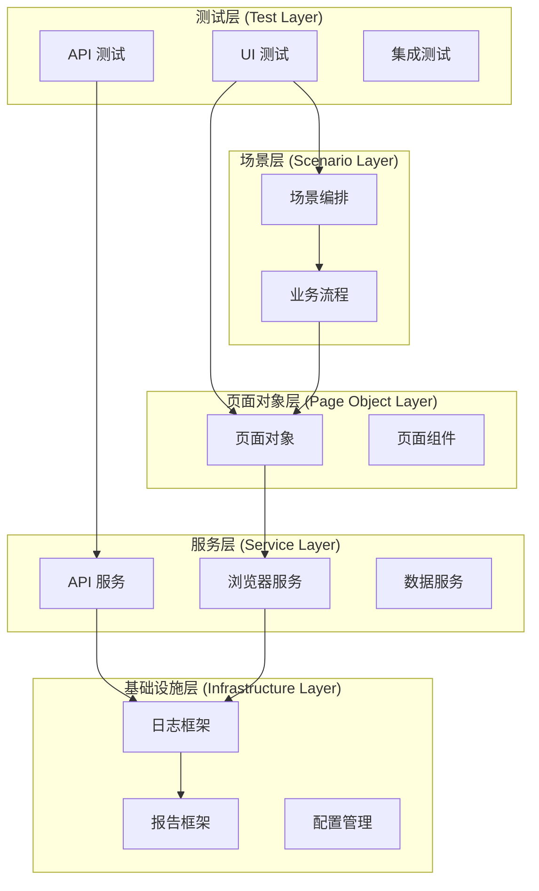

# 企业级 C# + Playwright + xUnit 自动化测试框架 - 综合文档

## 📋 目录

1. [项目概述](#项目概述)
2. [快速开始](#快速开始)
3. [架构设计](#架构设计)
4. [核心组件](#核心组件)
5. [使用指南](#使用指南)
6. [配置管理](#配置管理)
7. [测试执行](#测试执行)
8. [最佳实践](#最佳实践)
9. [故障排除](#故障排除)
10. [CI/CD 集成](#cicd-集成)

---

## 项目概述

### 🚀 主要特性

- **分层架构**：Tests → Scenarios → Flows → Pages/Components → Playwright/HTTP
- **多测试类型**：UI、API、集成、端到端测试
- **数据驱动**：支持 CSV、JSON、YAML 数据源
- **多环境支持**：dev、test、staging、prod 环境配置
- **并行执行**：提高测试执行效率
- **智能重试**：可配置的错误恢复机制
- **全面报告**：HTML 报告、截图、日志记录

### 📁 项目结构

```
CsPlaywrightXun/
├── src/
│   ├── playwright/
│   │   ├── Core/                    # 框架核心（稳定）
│   │   │   ├── Interfaces/          # 接口定义
│   │   │   ├── Base/               # 基类实现
│   │   │   ├── Configuration/      # 配置管理
│   │   │   └── Utilities/          # 工具类
│   │   ├── Services/               # 服务层（中等频率修改）
│   │   │   ├── Browser/            # 浏览器服务
│   │   │   ├── Api/               # API 服务
│   │   │   └── Data/              # 数据服务
│   │   ├── Pages/                 # 页面对象（频繁修改）
│   │   ├── Flows/                 # 业务流程（频繁修改）
│   │   └── Tests/                 # 测试用例（最频繁修改）
│   ├── config/                    # 配置文件
│   └── conclusion/                # 输出目录
└── docs/                          # 文档
```

---

## 快速开始

### 🛠️ 环境准备

**系统要求：**
- .NET 6.0+ 
- Visual Studio 2022 或 VS Code
- 8GB+ RAM（推荐 16GB）

**安装步骤：**

```bash
# 1. 验证 .NET 版本
dotnet --version

# 2. 克隆项目
git clone <repository-url>
cd CsPlaywrightXun

# 3. 还原依赖包
dotnet restore

# 4. 安装 Playwright 浏览器
pwsh bin/Debug/net6.0/playwright.ps1 install
```

### 📝 第一个测试

**1. 创建页面对象：**

```csharp
public class LoginPage : BasePageObjectWithPlaywright
{
    private const string UsernameSelector = "#username";
    private const string PasswordSelector = "#password";
    private const string LoginButtonSelector = "#login-btn";
    
    public LoginPage(IPage page, ILogger logger) : base(page, logger) { }
    
    public async Task LoginAsync(string username, string password)
    {
        await TypeAsync(UsernameSelector, username);
        await TypeAsync(PasswordSelector, password);
        await ClickAsync(LoginButtonSelector);
    }
    
    public override async Task<bool> IsLoadedAsync()
    {
        return await IsElementExistAsync(LoginButtonSelector);
    }
    
    public override async Task WaitForLoadAsync(int timeoutMs = 30000)
    {
        await WaitForElementAsync(LoginButtonSelector, timeoutMs);
    }
}
```

**2. 创建业务流程：**

```csharp
public class LoginFlow : BaseFlow
{
    private readonly LoginPage _loginPage;
    
    public LoginFlow(LoginPage loginPage, ILogger logger) : base(logger)
    {
        _loginPage = loginPage;
    }
    
    public override async Task ExecuteAsync(Dictionary<string, object> parameters = null)
    {
        var username = GetParameter<string>(parameters, "username");
        var password = GetParameter<string>(parameters, "password");
        
        Logger.LogInformation($"开始登录流程: {username}");
        
        await _loginPage.LoginAsync(username, password);
        
        Logger.LogInformation("登录流程完成");
    }
}
```

**3. 编写测试用例：**

```csharp
[UITest]
[TestPriority(TestPriority.High)]
public class LoginTests : IClassFixture<BrowserFixture>
{
    private readonly BrowserFixture _fixture;
    private readonly LoginPage _loginPage;
    private readonly LoginFlow _loginFlow;
    
    public LoginTests(BrowserFixture fixture)
    {
        _fixture = fixture;
        _loginPage = new LoginPage(_fixture.Page, _fixture.Logger);
        _loginFlow = new LoginFlow(_loginPage, _fixture.Logger);
    }
    
    [Theory]
    [CsvData("TestData/login_data.csv")]
    public async Task Login_WithValidCredentials_ShouldSucceed(LoginTestData data)
    {
        // Arrange
        await _loginPage.NavigateAsync(data.BaseUrl);
        await _loginPage.WaitForLoadAsync();
        
        // Act
        var parameters = new Dictionary<string, object>
        {
            ["username"] = data.Username,
            ["password"] = data.Password
        };
        await _loginFlow.ExecuteAsync(parameters);
        
        // Assert
        var isLoggedIn = await _loginPage.IsUserLoggedInAsync();
        Assert.True(isLoggedIn, "用户应该成功登录");
    }
}
```

**4. 运行测试：**

```bash
# 运行所有测试
dotnet test

# 运行 UI 测试
dotnet test --filter "Type=UI"

# 运行高优先级测试
dotnet test --filter "Priority=High"
```

---

## 架构设计

### 🏗️ 分层架构



### 🔌 核心接口

**IPageObject - 页面对象接口：**

```csharp
public interface IPageObject
{
    Task NavigateAsync(string url);
    Task<bool> IsLoadedAsync();
    Task WaitForLoadAsync(int timeoutMs = 30000);
}
```

**IFlow - 业务流程接口：**

```csharp
public interface IFlow
{
    Task ExecuteAsync(Dictionary<string, object> parameters = null);
}
```

**IApiClient - API 客户端接口：**

```csharp
public interface IApiClient
{
    Task<HttpResponseMessage> GetAsync(string endpoint, Dictionary<string, string> headers = null);
    Task<HttpResponseMessage> PostAsync(string endpoint, object data, Dictionary<string, string> headers = null);
    Task<HttpResponseMessage> PutAsync(string endpoint, object data, Dictionary<string, string> headers = null);
    Task<HttpResponseMessage> DeleteAsync(string endpoint, Dictionary<string, string> headers = null);
}
```

---

## 核心组件

### 📄 BasePageObjectWithPlaywright

提供丰富的页面操作方法：

```csharp
public abstract class BasePageObjectWithPlaywright : IPageObject
{
    protected readonly IPage _page;
    protected readonly ILogger Logger;
    
    // 导航方法
    public virtual async Task NavigateAsync(string url) { }
    public virtual async Task RefreshAsync() { }
    
    // 元素等待方法
    public virtual async Task WaitForElementAsync(string selector, int timeoutMs = 30000) { }
    public virtual async Task<bool> IsElementExistAsync(string selector, int timeoutMs = 5000) { }
    
    // 输入方法
    public virtual async Task TypeAsync(string selector, string text) { }
    public virtual async Task ClearAndTypeAsync(string selector, string text) { }
    
    // 点击方法
    public virtual async Task ClickAsync(string selector) { }
    public virtual async Task RightClickAsync(string selector) { }
    public virtual async Task DoubleClickAsync(string selector) { }
    
    // 获取信息方法
    public virtual async Task<string> GetTextAsync(string selector) { }
    public virtual async Task<string> GetAttributeAsync(string selector, string attributeName) { }
    public virtual async Task<string> GetTitleAsync() { }
    
    // 断言方法
    public virtual async Task<string> AssertEqualAsync(object actual, object expected) { }
    public virtual async Task<string> IsTextInElementAsync(string selector, string expectedText) { }
    
    // 截图方法
    public virtual async Task<byte[]> TakeScreenshotAsync(string fileName = null) { }
    
    // 抽象方法（子类必须实现）
    public abstract Task<bool> IsLoadedAsync();
    public abstract Task WaitForLoadAsync(int timeoutMs = 30000);
}
```

### 🔄 BaseFlow

业务流程基类：

```csharp
public abstract class BaseFlow : IFlow
{
    protected readonly ILogger Logger;
    
    protected BaseFlow(ILogger logger)
    {
        Logger = logger;
    }
    
    public abstract Task ExecuteAsync(Dictionary<string, object> parameters = null);
    
    // 参数验证和获取方法
    protected virtual void ValidateParameters(Dictionary<string, object> parameters, params string[] requiredKeys) { }
    protected virtual T GetParameter<T>(Dictionary<string, object> parameters, string key, T defaultValue = default) { }
}
```

### 🌐 API 测试基类

```csharp
public abstract class BaseApiTest
{
    protected readonly IApiClient _apiClient;
    protected readonly TestConfiguration _configuration;
    protected readonly ILogger _logger;
    
    protected async Task<ApiResponse<T>> ExecuteApiTestAsync<T>(ApiRequest request)
    {
        // 执行 API 请求并记录日志
        // 返回包含状态码、数据、响应时间等信息的响应对象
    }
    
    protected void AssertStatusCode<T>(ApiResponse<T> response, int expectedStatusCode) { }
    protected void AssertResponseTime<T>(ApiResponse<T> response, int maxResponseTimeMs) { }
}
```

---

## 使用指南

### 🎯 测试分类和标记

**使用测试属性进行分类：**

```csharp
[UITest]                              // 测试类型
[TestCategory(TestCategory.PageObject)] // 测试分类
[TestPriority(TestPriority.High)]      // 测试优先级
[SmokeTest]                           // 测试套件
[FastTest]                            // 测试速度
public class LoginTests : IClassFixture<BrowserFixture>
{
    [Fact]
    [TestTag("Authentication")]        // 自定义标签
    [TestEnvironment("Production")]    // 环境标记
    public async Task UserCanLogin() { }
}
```

**测试过滤执行：**

```bash
# 按类型过滤
dotnet test --filter "Type=UI"
dotnet test --filter "Type=API"

# 按优先级过滤
dotnet test --filter "Priority=High"
dotnet test --filter "Priority=Critical"

# 按速度过滤
dotnet test --filter "Speed=Fast"

# 按套件过滤
dotnet test --filter "Suite=Smoke"

# 组合条件
dotnet test --filter "Type=UI&Priority=High"
dotnet test --filter "(Type=UI|Type=API)&Priority=High"
```

### 📊 数据驱动测试

**CSV 数据源：**

```csv
# TestData/login_scenarios.csv
TestName,Username,Password,ExpectedResult,Environment
有效管理员登录,admin,admin123,success,Development
有效用户登录,user1,user123,success,Development
无效用户名,invalid,password,failure,Development
```

```csharp
public class LoginTestData
{
    public string TestName { get; set; }
    public string Username { get; set; }
    public string Password { get; set; }
    public string ExpectedResult { get; set; }
    public string Environment { get; set; }
}

[Theory]
[CsvData("TestData/login_scenarios.csv")]
public async Task Login_VariousScenarios_ShouldBehaveCorrectly(LoginTestData data)
{
    // 使用 data 对象中的测试数据
}
```

**JSON 数据源：**

```json
[
  {
    "testName": "复杂用户注册",
    "userData": {
      "email": "test@example.com",
      "password": "SecurePass123!",
      "profile": {
        "firstName": "张",
        "lastName": "三"
      }
    }
  }
]
```

### 🔧 API 测试示例

```csharp
[APITest]
[TestCategory(TestCategory.ApiClient)]
public class UserApiTests : BaseApiTest
{
    [Fact]
    public async Task GetUser_WithValidId_ShouldReturnUser()
    {
        // Arrange
        var request = new ApiRequest
        {
            Method = "GET",
            Endpoint = "/api/users/1",
            Headers = new Dictionary<string, string>
            {
                ["Authorization"] = "Bearer token"
            }
        };
        
        // Act
        var response = await ExecuteApiTestAsync<User>(request);
        
        // Assert
        AssertStatusCode(response, 200);
        AssertResponseTime(response, 2000);
        Assert.NotNull(response.Data);
        Assert.Equal(1, response.Data.Id);
    }
    
    [Theory]
    [JsonData("TestData/user_creation_data.json")]
    public async Task CreateUser_WithValidData_ShouldSucceed(UserCreationData data)
    {
        var request = new ApiRequest
        {
            Method = "POST",
            Endpoint = "/api/users",
            Body = data.UserData
        };
        
        var response = await ExecuteApiTestAsync<User>(request);
        
        AssertStatusCode(response, 201);
        Assert.Equal(data.UserData.Email, response.Data.Email);
    }
}
```

---

## 配置管理

### 🌍 环境配置

**appsettings.{Environment}.json：**

```json
{
  "Environment": {
    "Name": "Development",
    "BaseUrl": "https://dev.example.com",
    "ApiBaseUrl": "https://api-dev.example.com"
  },
  "Browser": {
    "Type": "Chromium",
    "Headless": false,
    "ViewportWidth": 1920,
    "ViewportHeight": 1080,
    "Timeout": 30000
  },
  "Api": {
    "Timeout": 30000,
    "RetryCount": 3,
    "RetryDelay": 1000
  },
  "Logging": {
    "Level": "Information",
    "FilePath": "src/conclusion/logs/test-{Date}.log"
  },
  "Reporting": {
    "OutputPath": "src/conclusion/reports",
    "Format": "Html",
    "IncludeScreenshots": true
  }
}
```

### 📋 页面元素配置

**elements/HomePage.yaml：**

```yaml
HomePage:
  SearchBox:
    selector: "#search-input"
    type: Input
    timeout: 5000
  SearchButton:
    selector: "#search-btn"
    type: Button
    timeout: 5000
  SearchResults:
    selector: ".search-result"
    type: Text
    timeout: 10000
```

**在代码中使用：**

```csharp
public class HomePage : BasePageObjectWithPlaywright
{
    private readonly YamlElementReader _elementReader;
    
    public HomePage(IPage page, ILogger logger, YamlElementReader elementReader) 
        : base(page, logger)
    {
        _elementReader = elementReader;
    }
    
    public async Task SearchAsync(string query)
    {
        var searchBox = _elementReader.GetElement("HomePage", "SearchBox");
        await TypeAsync(searchBox.Selector, query);
        
        var searchButton = _elementReader.GetElement("HomePage", "SearchButton");
        await ClickAsync(searchButton.Selector);
    }
}
```

---

## 测试执行

### 🏃‍♂️ 执行命令

**基本执行：**

```bash
# 运行所有测试
dotnet test

# 详细输出
dotnet test --verbosity normal

# 生成 HTML 报告
dotnet test --logger "html;LogFileName=test-results.html"
```

**过滤执行：**

```bash
# 测试类型过滤
dotnet test --filter "Type=UI"
dotnet test --filter "Type=API"
dotnet test --filter "Type=Integration"

# 优先级过滤
dotnet test --filter "Priority=Critical"
dotnet test --filter "Priority=High"

# 速度过滤
dotnet test --filter "Speed=Fast"
dotnet test --filter "!Speed=Slow"

# 环境过滤
dotnet test --filter "Environment=Production"

# 组合过滤
dotnet test --filter "Type=UI&Priority=High"
dotnet test --filter "(Type=UI|Type=API)&!Speed=Slow"
```

**并行执行：**

```bash
# 设置并行度
dotnet test --parallel --max-cpucount:4

# 禁用并行执行
dotnet test --parallel --max-cpucount:1
```

### 📊 报告查看

测试执行完成后，查看以下位置的报告：

- **HTML 报告**：`src/conclusion/reports/test-report.html`
- **日志文件**：`src/conclusion/logs/test-{Date}.log`
- **截图文件**：`src/conclusion/screenshots/`

---

## 最佳实践

### 🏗️ Page Object 设计原则

**1. 单一职责原则：**

```csharp
// ✅ 好的设计 - 职责单一
public class LoginPage : BasePageObjectWithPlaywright
{
    // 只包含登录页面相关的操作
    public async Task EnterUsernameAsync(string username) { }
    public async Task EnterPasswordAsync(string password) { }
    public async Task ClickLoginButtonAsync() { }
    public async Task<string> GetErrorMessageAsync() { }
}

// ❌ 避免的设计 - 职责过多
public class ApplicationPage : BasePageObjectWithPlaywright
{
    // 包含了多个页面的操作
    public async Task LoginAsync() { }
    public async Task NavigateToDashboardAsync() { }
    public async Task UpdateUserSettingsAsync() { }
}
```

**2. 封装复杂操作：**

```csharp
public class ProductSearchPage : BasePageObjectWithPlaywright
{
    public async Task SearchProductsAsync(string searchTerm, string category = null)
    {
        Logger.LogInformation($"搜索产品: {searchTerm}, 分类: {category}");
        
        // 输入搜索关键词
        await ClearAndTypeAsync("#search-input", searchTerm);
        
        // 选择分类（如果提供）
        if (!string.IsNullOrEmpty(category))
        {
            await SelectCategoryAsync(category);
        }
        
        // 点击搜索按钮
        await ClickAsync("#search-btn");
        
        // 等待结果加载
        await WaitForElementAsync(".search-results");
        
        Logger.LogInformation("产品搜索完成");
    }
    
    public async Task<List<ProductInfo>> GetSearchResultsAsync()
    {
        var results = new List<ProductInfo>();
        var resultElements = await _page.QuerySelectorAllAsync(".search-result-item");
        
        foreach (var element in resultElements)
        {
            var name = await element.QuerySelectorAsync(".product-name")?.InnerTextAsync();
            var price = await element.QuerySelectorAsync(".product-price")?.InnerTextAsync();
            results.Add(new ProductInfo { Name = name, Price = price });
        }
        
        return results;
    }
}
```

### 🔄 Flow 设计原则

**1. 流程参数管理：**

```csharp
// 定义强类型参数
public class UserRegistrationParameters
{
    public string Email { get; set; }
    public string Password { get; set; }
    public string FirstName { get; set; }
    public string LastName { get; set; }
    public bool AcceptTerms { get; set; } = true;
}

public class UserRegistrationFlow : BaseFlow
{
    public async Task ExecuteAsync(UserRegistrationParameters parameters)
    {
        Logger.LogInformation($"开始用户注册流程: {parameters.Email}");
        
        await _registrationPage.FillRegistrationFormAsync(parameters);
        await _registrationPage.SubmitRegistrationAsync();
        
        Logger.LogInformation("用户注册流程完成");
    }
    
    // 保持向后兼容
    public override async Task ExecuteAsync(Dictionary<string, object> parameters = null)
    {
        var typedParameters = ConvertToTypedParameters(parameters);
        await ExecuteAsync(typedParameters);
    }
}
```

**2. 流程组合：**

```csharp
public class CompleteUserOnboardingFlow : BaseFlow
{
    private readonly UserRegistrationFlow _registrationFlow;
    private readonly ProfileSetupFlow _profileSetupFlow;
    private readonly PreferencesConfigurationFlow _preferencesFlow;
    
    public override async Task ExecuteAsync(Dictionary<string, object> parameters = null)
    {
        Logger.LogInformation("开始完整的用户入职流程");
        
        try
        {
            await _registrationFlow.ExecuteAsync(parameters);
            await _profileSetupFlow.ExecuteAsync(parameters);
            await _preferencesFlow.ExecuteAsync(parameters);
            
            Logger.LogInformation("用户入职流程完成");
        }
        catch (Exception ex)
        {
            Logger.LogError(ex, "用户入职流程失败");
            throw;
        }
    }
}
```

### ✅ 测试用例编写

**1. AAA 模式：**

```csharp
[Theory]
[CsvData("TestData/login_data.csv")]
public async Task Login_WithValidCredentials_ShouldSucceed(LoginTestData data)
{
    // Arrange - 准备测试数据和环境
    await _loginPage.NavigateAsync(data.BaseUrl);
    await _loginPage.WaitForLoadAsync();
    
    var loginParameters = new Dictionary<string, object>
    {
        ["username"] = data.Username,
        ["password"] = data.Password
    };
    
    // Act - 执行被测试的操作
    await _loginFlow.ExecuteAsync(loginParameters);
    
    // Assert - 验证结果
    await _dashboardPage.WaitForLoadAsync();
    var isLoggedIn = await _dashboardPage.IsUserLoggedInAsync();
    Assert.True(isLoggedIn, "用户应该成功登录");
}
```

**2. 测试数据管理：**

```csharp
// 使用数据生成器
public class TestDataGenerator
{
    public UserTestData GenerateRandomUser()
    {
        return new UserTestData
        {
            Username = $"user_{Random.Next(1000, 9999)}",
            Email = $"test{Random.Next(1000, 9999)}@example.com",
            Password = GenerateRandomPassword()
        };
    }
    
    public UserTestData GenerateUserForScenario(string scenario)
    {
        return scenario.ToLower() switch
        {
            "admin" => new UserTestData { Username = "admin_user", Role = "Administrator" },
            "readonly" => new UserTestData { Username = "readonly_user", Role = "ReadOnly" },
            _ => GenerateRandomUser()
        };
    }
}
```

### ⚠️ 错误处理

**1. 重试机制：**

```csharp
public class RobustLoginPage : BasePageObjectWithPlaywright
{
    public async Task LoginWithRetryAsync(string username, string password)
    {
        var retryPolicy = new RetryPolicy
        {
            MaxAttempts = 3,
            DelayBetweenAttempts = TimeSpan.FromSeconds(1),
            RetryableExceptions = new List<Type>
            {
                typeof(ElementNotFoundException),
                typeof(TimeoutException)
            }
        };
        
        var retryExecutor = new RetryExecutor(retryPolicy, Logger);
        
        await retryExecutor.ExecuteAsync(async () =>
        {
            await EnterUsernameAsync(username);
            await EnterPasswordAsync(password);
            await ClickLoginButtonAsync();
        }, "登录操作");
    }
}
```

**2. 安全操作：**

```csharp
public async Task<bool> SafeClickAsync(string selector, int timeoutMs = 5000)
{
    try
    {
        await WaitForElementAsync(selector, timeoutMs);
        await ClickAsync(selector);
        return true;
    }
    catch (ElementNotFoundException ex)
    {
        Logger.LogWarning($"元素未找到: {selector}");
        return false;
    }
    catch (TimeoutException ex)
    {
        Logger.LogWarning($"元素等待超时: {selector}");
        return false;
    }
}
```

---

## 故障排除

### 🔧 常见问题

**Q1: 浏览器启动失败**

```bash
# 重新安装浏览器
pwsh bin/Debug/net6.0/playwright.ps1 install chromium

# 检查系统依赖（Linux）
sudo ./bin/Debug/net6.0/playwright.sh install-deps
```

**Q2: 元素未找到**

```csharp
// 1. 验证选择器
// 使用浏览器开发者工具: F12 -> Console -> document.querySelector('#element')

// 2. 增加等待时间
await page.WaitForSelectorAsync("#element", new PageWaitForSelectorOptions
{
    Timeout = 30000
});

// 3. 使用多种定位策略
await page.ClickAsync("#submit-button");        // CSS 选择器
await page.ClickAsync("xpath=//button[@id='submit-button']"); // XPath
await page.ClickAsync("text=提交");              // 文本内容
```

**Q3: 测试超时**

```csharp
// 1. 增加测试超时
[Fact(Timeout = 60000)]
public async Task MyTest() { }

// 2. 配置 Playwright 超时
page.SetDefaultTimeout(60000);

// 3. 使用智能等待
await page.WaitForSelectorAsync("#element"); // ✅
// 避免固定等待
// await Task.Delay(5000); // ❌
```

**Q4: 并行执行冲突**

```csharp
// 1. 禁用并行执行
[Collection("NonParallel")]
public class DatabaseTests { }

// 2. 使用独立上下文
public async Task<IBrowserContext> CreateContextAsync()
{
    return await _browser.NewContextAsync(); // 每个测试独立上下文
}
```

### 🔍 调试技巧

**1. 启用详细日志：**

```json
{
  "Logging": {
    "Level": "Debug"
  }
}
```

**2. 禁用无头模式：**

```json
{
  "Browser": {
    "Headless": false,
    "SlowMo": 1000
  }
}
```

**3. 截图调试：**

```csharp
public async Task DebugWithScreenshots()
{
    await page.ScreenshotAsync(new PageScreenshotOptions { Path = "before-action.png" });
    await page.ClickAsync("#button");
    await page.ScreenshotAsync(new PageScreenshotOptions { Path = "after-action.png" });
}
```

**4. 页面内容检查：**

```csharp
public async Task InspectPageContent()
{
    var content = await page.ContentAsync();
    File.WriteAllText("page-content.html", content);
    
    var title = await page.TitleAsync();
    Logger.LogInformation($"Page title: {title}, URL: {page.Url}");
}
```

---

## CI/CD 集成

### 🚀 Azure DevOps 管道

**基本管道配置：**

```yaml
trigger:
  branches:
    include:
    - main
    - develop

variables:
  buildConfiguration: 'Release'
  dotnetVersion: '8.0.x'

stages:
- stage: Build
  jobs:
  - job: BuildAndTest
    pool:
      vmImage: 'ubuntu-latest'
    
    steps:
    - task: UseDotNet@2
      displayName: 'Setup .NET SDK'
      inputs:
        packageType: 'sdk'
        version: $(dotnetVersion)
    
    - task: DotNetCoreCLI@2
      displayName: 'Restore packages'
      inputs:
        command: 'restore'
    
    - task: DotNetCoreCLI@2
      displayName: 'Build solution'
      inputs:
        command: 'build'
        arguments: '--no-restore --configuration $(buildConfiguration)'
    
    - task: DotNetCoreCLI@2
      displayName: 'Run unit tests'
      inputs:
        command: 'test'
        arguments: '--no-build --configuration $(buildConfiguration) --filter "Category=Unit"'
    
    - task: PowerShell@2
      displayName: 'Install Playwright browsers'
      inputs:
        targetType: 'inline'
        script: |
          pwsh CsPlaywrightXun/bin/Release/net8.0/playwright.ps1 install
    
    - task: DotNetCoreCLI@2
      displayName: 'Run UI tests'
      inputs:
        command: 'test'
        arguments: '--no-build --configuration $(buildConfiguration) --filter "Type=UI"'
    
    - task: PublishTestResults@2
      displayName: 'Publish test results'
      condition: always()
      inputs:
        testResultsFormat: 'VSTest'
        testResultsFiles: '**/*.trx'
    
    - task: PublishBuildArtifacts@1
      displayName: 'Publish screenshots'
      condition: always()
      inputs:
        pathToPublish: 'screenshots'
        artifactName: 'screenshots'
```

### 🐳 Docker 支持

**Dockerfile：**

```dockerfile
FROM mcr.microsoft.com/dotnet/sdk:8.0

# 安装浏览器依赖
RUN apt-get update && apt-get install -y \
    libnss3 \
    libatk-bridge2.0-0 \
    libdrm2 \
    libxkbcommon0 \
    libxcomposite1 \
    libxdamage1 \
    libxrandr2 \
    libgbm1 \
    libxss1 \
    libasound2

WORKDIR /app
COPY . .

RUN dotnet restore
RUN dotnet build --configuration Release

# 安装 Playwright 浏览器
RUN pwsh bin/Release/net8.0/playwright.ps1 install

CMD ["dotnet", "test", "--configuration", "Release"]
```

**docker-compose.yml：**

```yaml
version: '3.8'
services:
  automation-tests:
    build: .
    environment:
      - ASPNETCORE_ENVIRONMENT=Test
      - Browser__Headless=true
    volumes:
      - ./test-results:/app/test-results
      - ./screenshots:/app/screenshots
```

### 📊 监控和告警

**关键指标监控：**

```yaml
# Prometheus 告警规则
groups:
- name: automation-tests
  rules:
  - alert: TestFailureRate
    expr: (test_failures / test_total) > 0.1
    for: 15m
    labels:
      severity: warning
    annotations:
      summary: "测试失败率过高"
      description: "测试失败率为 {{ $value | humanizePercentage }}"
  
  - alert: TestExecutionTime
    expr: test_duration_seconds > 1800
    for: 5m
    labels:
      severity: warning
    annotations:
      summary: "测试执行时间过长"
      description: "测试执行时间为 {{ $value | humanizeDuration }}"
```

---

## 📚 参考资源

### 📖 相关文档

- [Playwright 官方文档](https://playwright.dev/dotnet/)
- [xUnit 官方文档](https://xunit.net/)
- [.NET 测试指南](https://docs.microsoft.com/en-us/dotnet/core/testing/)

### 🛠️ 工具推荐

- **IDE**: Visual Studio 2022, VS Code, JetBrains Rider
- **浏览器**: Chrome DevTools, Firefox Developer Tools
- **监控**: Prometheus + Grafana
- **报告**: Allure, ExtentReports

### 📞 支持渠道

- **文档**: 项目 docs/ 目录
- **日志**: src/conclusion/logs/ 目录
- **截图**: src/conclusion/screenshots/ 目录
- **Issue**: 项目仓库 Issues 页面

---

*本文档涵盖了企业级自动化测试框架的核心功能和最佳实践。如需更详细的信息，请参考项目中的具体文档文件。*