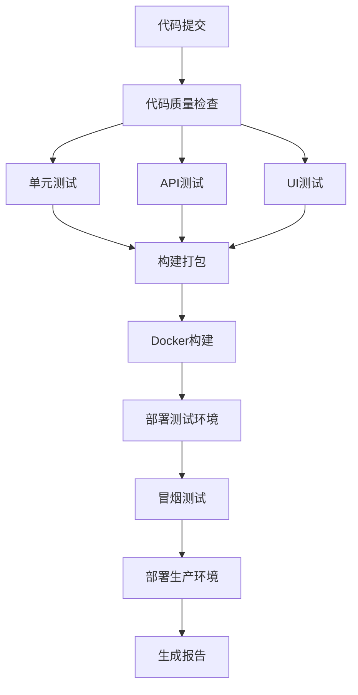
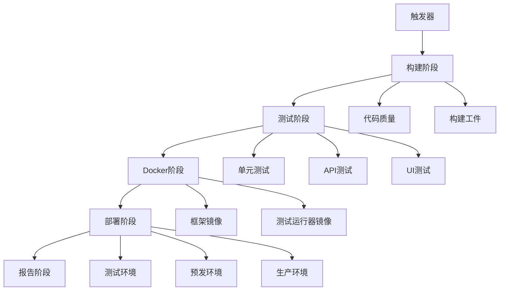

# CI/CD 运维操作指南

## 概述

本文档提供了企业级自动化测试框架 CI/CD 管道的详细运维操作指南，包括管道配置、监控、故障排除和最佳实践。

## 目录

1. [管道架构](#管道架构)
2. [日常运维操作](#日常运维操作)
3. [监控和告警](#监控和告警)
4. [故障排除](#故障排除)
5. [性能优化](#性能优化)
6. [安全管理](#安全管理)

## 管道架构

### GitHub Actions 管道结构



### Azure DevOps 管道结构



## 日常运维操作

### 1. 管道监控

#### GitHub Actions 监控

```bash
# 查看工作流状态
gh workflow list

# 查看特定工作流运行
gh run list --workflow=ci-cd.yml

# 查看运行详情
gh run view <run-id>

# 下载工件
gh run download <run-id>
```

#### Azure DevOps 监控

```bash
# 查看管道列表
az pipelines list --organization https://dev.azure.com/your-org --project your-project

# 查看管道运行
az pipelines runs list --pipeline-name "Enterprise Automation Framework CI/CD"

# 查看运行详情
az pipelines runs show --id <run-id>
```

### 2. 手动触发管道

#### GitHub Actions 手动触发

```bash
# 通过 CLI 触发
gh workflow run ci-cd.yml -f environment=staging -f runUITests=true

# 通过 API 触发
curl -X POST \
  -H "Accept: application/vnd.github.v3+json" \
  -H "Authorization: token $GITHUB_TOKEN" \
  https://api.github.com/repos/owner/repo/actions/workflows/ci-cd.yml/dispatches \
  -d '{"ref":"main","inputs":{"environment":"staging"}}'
```

#### Azure DevOps 手动触发

```bash
# 通过 CLI 触发
az pipelines run --name "Enterprise Automation Framework CI/CD" \
  --parameters environment=staging runUITests=true

# 通过 REST API 触发
curl -X POST \
  -H "Content-Type: application/json" \
  -H "Authorization: Basic $AZURE_DEVOPS_TOKEN" \
  https://dev.azure.com/your-org/your-project/_apis/pipelines/{pipeline-id}/runs?api-version=6.0 \
  -d '{"resources":{"repositories":{"self":{"refName":"refs/heads/main"}}}}'
```

### 3. 环境管理

#### 环境状态检查

```bash
# 检查测试环境
curl -f http://test-env.company.com/health || echo "Test environment down"

# 检查预发环境
curl -f http://staging-env.company.com/health || echo "Staging environment down"

# 检查生产环境
curl -f http://prod-env.company.com/health || echo "Production environment down"
```

#### 环境部署状态

```bash
# Kubernetes 环境检查
kubectl get deployments -n automation-framework-test
kubectl get deployments -n automation-framework-staging
kubectl get deployments -n automation-framework-prod

# 检查服务状态
kubectl get services -n automation-framework-test
kubectl get ingress -n automation-framework-test
```

### 4. 测试结果管理

#### 测试报告收集

```bash
# 下载最新测试报告
gh run download --name consolidated-test-reports

# 解压并查看报告
unzip consolidated-test-reports.zip
open index.html
```

#### 测试数据分析

```bash
# 分析测试趋势
python scripts/analyze-test-trends.py --days 30

# 生成测试质量报告
python scripts/generate-quality-report.py --environment staging
```

## 监控和告警

### 1. 管道健康监控

#### 关键指标

```yaml
# 管道成功率
pipeline_success_rate:
  query: sum(rate(pipeline_runs_total{status="success"}[24h])) / sum(rate(pipeline_runs_total[24h]))
  threshold: 0.95

# 平均构建时间
average_build_time:
  query: avg(pipeline_duration_seconds)
  threshold: 1800  # 30分钟

# 测试通过率
test_pass_rate:
  query: sum(rate(test_results_total{status="passed"}[24h])) / sum(rate(test_results_total[24h]))
  threshold: 0.90
```

#### 告警配置

```yaml
# Prometheus 告警规则
groups:
- name: cicd-pipeline
  rules:
  - alert: PipelineFailureRate
    expr: (1 - pipeline_success_rate) > 0.1
    for: 15m
    labels:
      severity: warning
    annotations:
      summary: "CI/CD pipeline failure rate is high"
      description: "Pipeline failure rate is {{ $value | humanizePercentage }}"

  - alert: LongBuildTime
    expr: pipeline_duration_seconds > 3600
    for: 5m
    labels:
      severity: warning
    annotations:
      summary: "Build time is too long"
      description: "Build took {{ $value | humanizeDuration }}"

  - alert: TestFailureSpike
    expr: increase(test_results_total{status="failed"}[1h]) > 10
    for: 5m
    labels:
      severity: critical
    annotations:
      summary: "Test failure spike detected"
      description: "{{ $value }} tests failed in the last hour"
```

### 2. 基础设施监控

#### 资源使用监控

```bash
# 监控构建节点资源
kubectl top nodes -l role=build-agent

# 监控存储使用
kubectl get pvc -n automation-framework --show-labels
df -h /var/lib/docker

# 监控网络流量
iftop -i eth0
```

#### 容器健康监控

```bash
# 检查容器状态
docker stats --no-stream

# 检查容器日志
docker logs --tail 100 automation-framework

# 检查容器资源限制
docker inspect automation-framework | jq '.HostConfig.Memory'
```

## 故障排除

### 1. 常见管道故障

#### 构建失败

```bash
# 检查构建日志
gh run view <run-id> --log

# 检查依赖问题
dotnet restore --verbosity detailed

# 检查编译错误
dotnet build --verbosity normal
```

#### 测试失败

```bash
# 查看测试详细输出
dotnet test --logger "console;verbosity=detailed"

# 检查测试环境
kubectl describe pod test-runner-pod -n automation-framework

# 查看测试数据
kubectl exec -it test-runner-pod -- ls -la /tests/config
```

#### 部署失败

```bash
# 检查 Kubernetes 部署状态
kubectl rollout status deployment/automation-framework -n automation-framework

# 查看部署事件
kubectl get events -n automation-framework --sort-by='.lastTimestamp'

# 检查镜像拉取
kubectl describe pod <pod-name> -n automation-framework
```

### 2. 性能问题诊断

#### 构建性能

```bash
# 分析构建时间
gh run list --workflow=ci-cd.yml --json conclusion,createdAt,updatedAt | \
  jq '.[] | select(.conclusion=="success") | (.updatedAt | fromdateiso8601) - (.createdAt | fromdateiso8601)'

# 检查缓存效率
docker system df
docker builder prune --filter until=24h
```

#### 测试性能

```bash
# 分析测试执行时间
dotnet test --logger "trx" --results-directory results
python scripts/analyze-test-performance.py results/

# 检查并行执行效果
kubectl logs -l app=ui-test-job -n automation-framework | grep "Test execution time"
```

### 3. 网络问题

#### 连接问题诊断

```bash
# 测试外部连接
curl -v https://api.github.com
curl -v https://registry.hub.docker.com

# 测试内部服务连接
kubectl run debug --image=busybox -it --rm -- nslookup automation-framework-service

# 检查防火墙规则
iptables -L
ufw status
```

#### DNS 问题

```bash
# 检查 DNS 解析
nslookup github.com
dig github.com

# 检查 Kubernetes DNS
kubectl get svc -n kube-system | grep dns
kubectl logs -n kube-system -l k8s-app=kube-dns
```

## 性能优化

### 1. 构建优化

#### Docker 构建优化

```dockerfile
# 使用多阶段构建
FROM mcr.microsoft.com/dotnet/sdk:8.0 AS build
# ... 构建步骤

FROM mcr.microsoft.com/dotnet/aspnet:8.0 AS runtime
# ... 运行时步骤

# 使用 BuildKit 缓存
# syntax=docker/dockerfile:1
FROM mcr.microsoft.com/dotnet/sdk:8.0 AS build
RUN --mount=type=cache,target=/root/.nuget/packages \
    dotnet restore
```

#### 缓存策略

```yaml
# GitHub Actions 缓存
- name: Cache NuGet packages
  uses: actions/cache@v3
  with:
    path: ~/.nuget/packages
    key: ${{ runner.os }}-nuget-${{ hashFiles('**/*.csproj') }}

# Docker 层缓存
- name: Set up Docker Buildx
  uses: docker/setup-buildx-action@v2
  with:
    driver-opts: |
      image=moby/buildkit:master
      network=host
```

### 2. 测试优化

#### 并行测试执行

```xml
<!-- 配置测试并行执行 -->
<PropertyGroup>
  <ParallelizeTestCollections>true</ParallelizeTestCollections>
  <MaxParallelThreads>4</MaxParallelThreads>
</PropertyGroup>
```

#### 测试分片

```bash
# 按测试类别分片
dotnet test --filter "Category=Unit" --parallel
dotnet test --filter "Category=Integration" --parallel
dotnet test --filter "Category=UI" --no-parallel
```

### 3. 资源优化

#### Kubernetes 资源调优

```yaml
# 优化资源请求和限制
resources:
  requests:
    memory: "512Mi"
    cpu: "250m"
  limits:
    memory: "1Gi"
    cpu: "500m"

# 配置 HPA
apiVersion: autoscaling/v2
kind: HorizontalPodAutoscaler
metadata:
  name: automation-framework-hpa
spec:
  scaleTargetRef:
    apiVersion: apps/v1
    kind: Deployment
    name: automation-framework
  minReplicas: 2
  maxReplicas: 10
  metrics:
  - type: Resource
    resource:
      name: cpu
      target:
        type: Utilization
        averageUtilization: 70
```

## 安全管理

### 1. 密钥管理

#### GitHub Secrets 管理

```bash
# 添加 Secret
gh secret set DOCKER_PASSWORD --body "your-password"

# 列出 Secrets
gh secret list

# 删除 Secret
gh secret delete DOCKER_PASSWORD
```

#### Azure DevOps 变量管理

```bash
# 创建变量组
az pipelines variable-group create --name "automation-secrets" \
  --variables DOCKER_PASSWORD="your-password" --authorize true

# 更新变量
az pipelines variable-group variable update --group-id <group-id> \
  --name DOCKER_PASSWORD --value "new-password"
```

### 2. 镜像安全

#### 漏洞扫描

```bash
# 使用 Trivy 扫描
trivy image --severity HIGH,CRITICAL your-registry.com/automation-framework:latest

# 使用 Snyk 扫描
snyk container test your-registry.com/automation-framework:latest

# 集成到管道中
- name: Run Trivy vulnerability scanner
  uses: aquasecurity/trivy-action@master
  with:
    image-ref: 'your-registry.com/automation-framework:latest'
    format: 'sarif'
    output: 'trivy-results.sarif'
```

#### 镜像签名

```bash
# 使用 Cosign 签名镜像
cosign sign --key cosign.key your-registry.com/automation-framework:latest

# 验证镜像签名
cosign verify --key cosign.pub your-registry.com/automation-framework:latest
```

### 3. 访问控制

#### RBAC 配置

```yaml
# Kubernetes RBAC
apiVersion: rbac.authorization.k8s.io/v1
kind: Role
metadata:
  namespace: automation-framework
  name: automation-deployer
rules:
- apiGroups: ["apps"]
  resources: ["deployments"]
  verbs: ["get", "list", "create", "update", "patch"]
- apiGroups: [""]
  resources: ["services", "configmaps"]
  verbs: ["get", "list", "create", "update"]

---
apiVersion: rbac.authorization.k8s.io/v1
kind: RoleBinding
metadata:
  name: automation-deployer-binding
  namespace: automation-framework
subjects:
- kind: ServiceAccount
  name: automation-deployer
  namespace: automation-framework
roleRef:
  kind: Role
  name: automation-deployer
  apiGroup: rbac.authorization.k8s.io
```

## 最佳实践

### 1. 管道设计原则

- **快速反馈**：优先运行快速测试
- **并行执行**：最大化并行度
- **失败快速**：早期发现问题
- **可重复性**：确保构建可重现
- **可观测性**：完整的日志和监控

### 2. 部署策略

- **蓝绿部署**：零停机部署
- **金丝雀发布**：渐进式发布
- **回滚机制**：快速回滚能力
- **健康检查**：完整的健康检查
- **监控告警**：实时监控和告警

### 3. 运维自动化

- **自动化测试**：全面的自动化测试覆盖
- **自动化部署**：完全自动化的部署流程
- **自动化监控**：智能监控和告警
- **自动化恢复**：自动故障恢复
- **自动化扩缩容**：基于负载的自动扩缩容

## 联系和支持

### 技术支持

- **邮箱**：devops-support@company.com
- **Slack**：#automation-framework-support
- **文档**：https://wiki.company.com/cicd-operations

### 紧急联系

- **值班电话**：+86-xxx-xxxx-xxxx
- **紧急邮箱**：emergency-devops@company.com
- **事故响应**：https://incident.company.com

### 培训资源

- **CI/CD 培训**：https://training.company.com/cicd
- **Kubernetes 培训**：https://training.company.com/k8s
- **Docker 培训**：https://training.company.com/docker