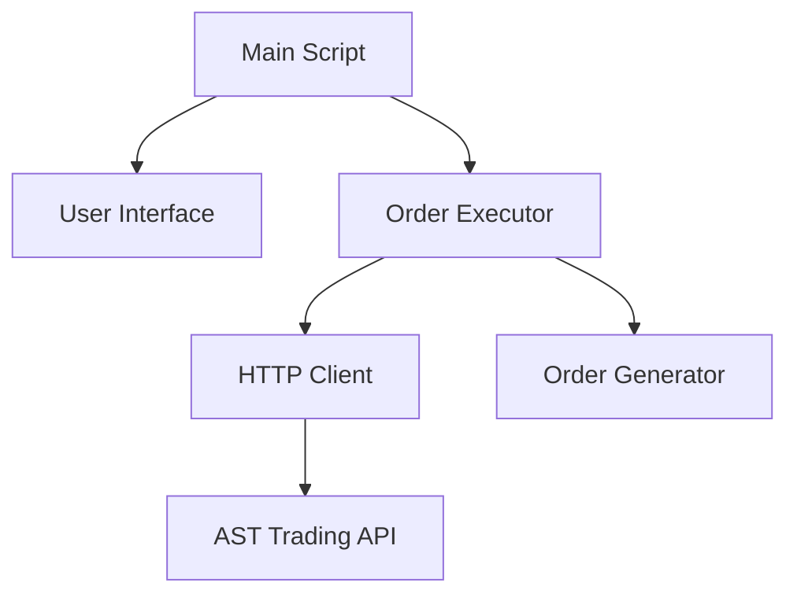

# Design Document

## Overview

这是一个简单的Python命令行脚本，用于自动化执行AST交易平台的买入和卖出订单。脚本将提供交互式界面让用户选择操作类型和执行次数，然后批量发送HTTP请求到交易API。

## Architecture



脚本采用简单的模块化设计：
- **Main Script**: 程序入口点，协调各个组件
- **User Interface**: 处理用户输入和显示输出
- **Order Executor**: 执行订单请求的核心逻辑
- **HTTP Client**: 处理HTTP请求发送
- **Order Generator**: 生成订单参数

## Components and Interfaces

### Main Script
```python
def main():
    # 程序主入口
    pass

if __name__ == "__main__":
    main()
```

### User Interface Module
```python
class UserInterface:
    def get_operation_choice(self) -> str:
        # 获取用户选择的操作类型（买入/卖出）
        pass
    
    def get_execution_count(self) -> int:
        # 获取用户输入的执行次数
        pass
    
    def show_summary(self, operation: str, count: int) -> bool:
        # 显示操作摘要并获取用户确认
        pass
    
    def show_progress(self, current: int, total: int, status: str):
        # 显示执行进度
        pass
```

### Order Executor Module
```python
class OrderExecutor:
    def __init__(self, http_client: HTTPClient):
        self.http_client = http_client
    
    def execute_buy_orders(self, count: int):
        # 执行指定次数的买入订单
        pass
    
    def execute_sell_orders(self, count: int):
        # 执行指定次数的卖出订单
        pass
    
    def _execute_single_order(self, order_data: dict) -> dict:
        # 执行单个订单请求
        pass
```

### HTTP Client Module
```python
class HTTPClient:
    def __init__(self):
        self.session = requests.Session()
        self._setup_headers()
    
    def _setup_headers(self):
        # 设置请求头和cookies
        pass
    
    def post_order(self, url: str, data: dict) -> requests.Response:
        # 发送POST请求
        pass
```

### Order Generator Module
```python
class OrderGenerator:
    @staticmethod
    def generate_buy_order() -> dict:
        # 生成买入订单数据
        pass
    
    @staticmethod
    def generate_sell_order() -> dict:
        # 生成卖出订单数据
        pass
    
    @staticmethod
    def generate_client_order_id() -> str:
        # 生成唯一的客户端订单ID
        pass
```

## Data Models

### Order Data Structure
```python
@dataclass
class OrderData:
    side: str  # BUY_OPEN 或 SELL_OPEN
    type: str  # LIMIT
    price_type: str  # MARKET_PRICE
    trigger_price: str  # 空字符串
    leverage: int  # 400
    quantity: float  # 3.00 或 4.00
    symbol_id: str  # BTCUSDT_PERP
    client_order_id: str  # 时间戳生成的唯一ID
    exchange_id: int  # 888
    order_side: str  # BUY 或 SELL
    is_cross: bool  # True
    time_in_force: str  # IOC
    deduction: str  # score
```

### API Configuration
```python
@dataclass
class APIConfig:
    base_url: str = "https://www.ast1001.com"
    endpoint: str = "/api/contract/order/create"
    c_token: str = "LoPMadD6q1VLvHcIDJC4OffUz8Ifi7qN"
    
    headers: dict = field(default_factory=lambda: {
        'accept': 'application/json, text/plain, */*',
        'accept-language': 'zh-hk',
        'content-type': 'application/x-www-form-urlencoded',
        'origin': 'https://www.ast1001.com',
        'referer': 'https://www.ast1001.com/zh-hk/futures/BTCUSDT_PERP',
        'timezone': 'GMT+0800',
        'user-agent': 'Mozilla/5.0 (Windows NT 10.0; Win64; x64) AppleWebKit/537.36',
        'x-requested-with': 'XMLHttpRequest'
    })
    
    cookies: str = "device=fb892b5b376336fbfffb6541f42dc041; unit=USD; ..."
```

## Correctness Properties

*A property is a characteristic or behavior that should hold true across all valid executions of a system-essentially, a formal statement about what the system should do. Properties serve as the bridge between human-readable specifications and machine-verifiable correctness guarantees.*

### Property Reflection

After analyzing the acceptance criteria, I identified several properties that can be consolidated:
- Properties 1.1 and 2.1 (execution count validation) can be combined into a single property about order execution count
- Properties 1.2 and 2.2 (request format validation) can be combined into a single property about HTTP request correctness
- Properties 1.3 and 2.3 (status display) can be combined into a single property about result reporting

### Core Properties

**Property 1: Order execution count accuracy**
*For any* positive integer count and order type (buy/sell), executing orders should result in exactly that many HTTP requests being sent to the API
**Validates: Requirements 1.1, 2.1**

**Property 2: HTTP request format correctness**
*For any* order type (buy/sell), all generated HTTP requests should contain the required headers, cookies, and form data as specified in the original curl commands
**Validates: Requirements 1.2, 2.2**

**Property 3: Status reporting completeness**
*For any* completed order execution, the script should display status information for each individual request
**Validates: Requirements 1.3, 2.3**

**Property 4: Request timing compliance**
*For any* sequence of multiple orders, consecutive HTTP requests should have appropriate delays between them to avoid overwhelming the API
**Validates: Requirements 1.4**

**Property 5: Client order ID uniqueness**
*For any* sequence of orders, all generated client_order_id values should be unique within the execution session
**Validates: Requirements 2.4**

**Property 6: Input validation and error handling**
*For any* invalid user input (negative numbers, non-numeric values), the script should display appropriate error messages and prompt for re-entry
**Validates: Requirements 3.3**

**Property 7: User interface flow consistency**
*For any* valid user interaction sequence, the script should follow the expected flow: operation selection → count input → confirmation → execution
**Validates: Requirements 3.2, 3.4**

## Error Handling

### Input Validation Errors
- Invalid operation choice (not buy/sell): Display error and re-prompt
- Invalid execution count (non-positive integer): Display error and re-prompt
- Empty or whitespace input: Treat as invalid and re-prompt

### Network Errors
- Connection timeout: Display error message and exit gracefully
- HTTP error responses: Display response status and error details
- Network unavailable: Display connection error and exit

### API Errors
- Authentication failures: Display auth error and suggest token refresh
- Rate limiting: Display rate limit message and suggest retry later
- Invalid order parameters: Display parameter validation errors

## Testing Strategy

### Dual Testing Approach
The system will use both unit tests and property-based tests for comprehensive coverage:

**Unit Tests**: Focus on specific examples, edge cases, and error conditions
- Test specific user input scenarios (valid/invalid inputs)
- Test HTTP client setup and configuration
- Test order data generation with known values
- Test error handling for specific network conditions

**Property-Based Tests**: Verify universal properties across all inputs
- Use `hypothesis` library for Python property-based testing
- Configure each test to run minimum 100 iterations
- Test order execution count accuracy across random valid inputs
- Test HTTP request format consistency across different order types
- Test client order ID uniqueness across random execution sequences

### Property Test Configuration
Each property-based test will be tagged with comments referencing the design document:
```python
# Feature: trading-api-automation, Property 1: Order execution count accuracy
# Feature: trading-api-automation, Property 5: Client order ID uniqueness
```

### Test Coverage Areas
1. **User Interface Testing**: Input validation, flow control, display formatting
2. **HTTP Client Testing**: Request formatting, header setup, error handling
3. **Order Generation Testing**: Data structure creation, ID uniqueness, parameter validation
4. **Integration Testing**: End-to-end flow from user input to API request
5. **Error Scenario Testing**: Network failures, invalid responses, authentication issues